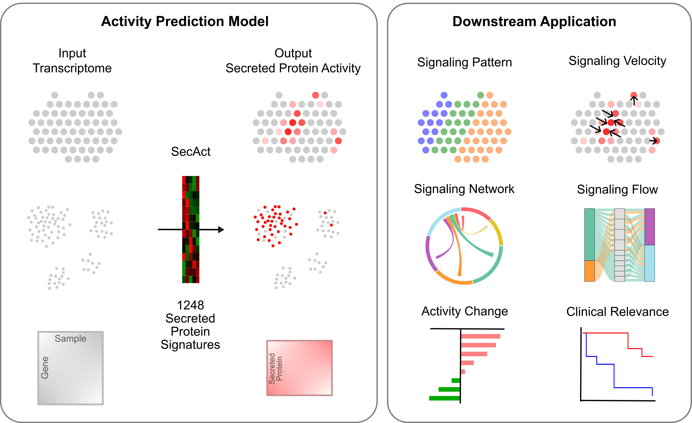

<!-- README.md is generated from README.Rmd. Please edit that file -->

# SecAct: Secreted Protein Activity Inference 

<!-- badges: start -->
<!-- badges: end -->

SecAct is an R package designed for inferring the intercellular
signaling activity of secreted proteins from gene expression profiles.
Users can input multiple modalities of expression data, including
spatial, single-cell, or bulk transcriptomics data. The outputs are the
inferred activities of 1248 secreted proteins for each ST spot,
individual cell, or sample. Based on the inferred activities, SecAct
provides multiple downstream application modules. For spatial data,
SecAct can infer the signaling pattern and signaling velocity for
secreted proteins. For single-cell data, SecAct can infer the
intercellular communication network and signaling flow from source cells
to receiver cells. For bulk data, SecAct can infer secreted protein risk
scores for a large cohort linked to clinical data, and can infer
secreted protein activities that are differentially regulated between
two phenotypes.

<p align="center">

</p>

## Installation

To install `SecAct`, we recommend using `devtools`:

``` r
# install.packages("devtools")
devtools::install_github("data2intelligence/SecAct")
```

Or user can install `SecAct` from the source code. Click
<a href="https://api.github.com/repos/data2intelligence/SecAct/tarball/HEAD" target="_blank">here</a>
to download it.

``` r
# install SecAct in the R environment.
install.packages("Path_to_the_source_code", repos = NULL, type="source")
```

## Dependencies

- C Library: GNU Scientific Library (GSL).
- R version \>= 4.2.0.
- R packages: Matrix, ggplot2, patchwork.

The R package has been installed successfully on Operating systems:

- macOS Sonoma 15.3.1
- Rocky Linux 8.7 (Green Obsidian)

## Example

``` r
library(SecAct)

# load differenrial profile
dataPath <- file.path(system.file(package = "SecAct"), "extdata/")
expr.diff <- read.table(paste0(dataPath, "Ly86.OverExpression_vs_Vector_logFC.txt"))

# Run SecAct to infer activity change
res <- SecAct.activity.inference(inputProfile = expr.diff, is.differential = TRUE)

# show results
head(res$zscore)
```

## Tutorial

#### Spatial transcriptomcis (ST) data

- [Signaling patterns and velocities for multi-cellular ST
  data](https://data2intelligence.github.io/SecAct/articles/stPattern.html)  
- [Intercellular communication for single-cell resolution ST
  data](https://data2intelligence.github.io/SecAct/articles/stCCC.html)

#### Single-cell RNA sequencing data

- [Cell-cell communication mediated by secreted
  proteins](https://data2intelligence.github.io/SecAct/articles/scCCC.html)  
- [Secreted protein signaling activity for various cell
  states](https://data2intelligence.github.io/SecAct/articles/scState.html)

#### Bulk RNA sequencing data

- [Secreted protein activity difference between two
  phenotypes](https://data2intelligence.github.io/SecAct/articles/bulkDiff.html)
- [Clinical relavance of secreted proteins in a large patient
  cohort](https://data2intelligence.github.io/SecAct/articles/bulkCohort.html)

## Citation

Beibei Ru, Lanqi Gong, Emily Yang, Kenneth Aldape, Lalage Wakefield,
Peng Jiang. Inference of secreted protein activities in intercellular
communication.
\[<a href="https://github.com/data2intelligence/SecAct" target="_blank">Link</a>\]
