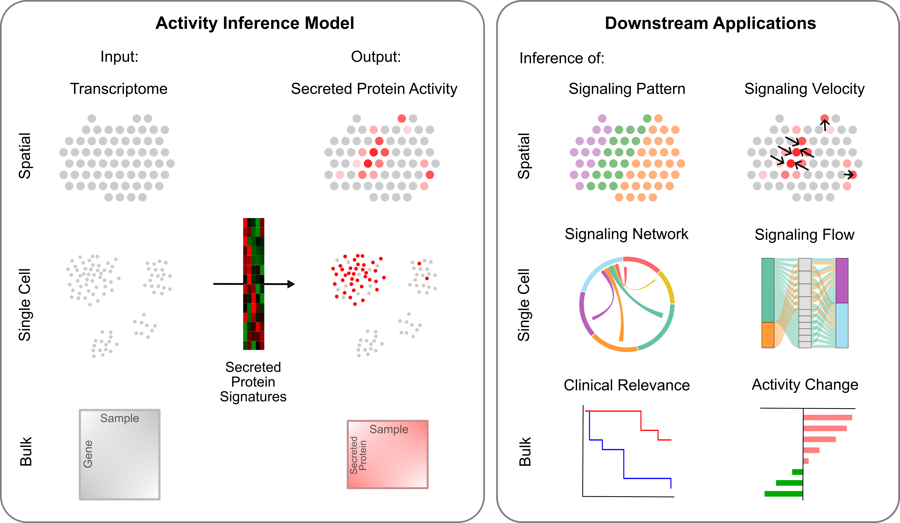

<!-- README.md is generated from README.Rmd. Please edit that file -->

# SecAct: Secreted Protein Activity Inference 

<!-- badges: start -->

<!-- badges: end -->

SecAct is an R package designed for inferring the intercellular
signaling activity of secreted proteins from gene expression profiles.
Users can input multiple modalities of expression data, including
spatial, single-cell, or bulk transcriptomics data. The outputs are the
inferred <b>signaling activities of \>1,000 secreted proteins</b> for
each spatial spot, individual cell, or sample, depending on the input
data type. Based on the inferred activities, SecAct provides multiple
downstream application modules. For <b>spatial data</b>, SecAct can
infer the signaling pattern and signaling velocity for secreted
proteins. For <b>single-cell data</b>, SecAct can infer the
intercellular communication network and signaling flow from source cells
to receiver cells. For <b>bulk data</b>, SecAct can infer secreted
protein risk scores for a large cohort linked to clinical data, and can
infer secreted protein activities that are differentially regulated
between two phenotypes. These functionalities and terms are explained
more formally in the following tutorials.

<p align="center">


</p>

## Installation

To install `SecAct` R package, we recommend using `devtools`:

``` r
# install.packages("devtools")
devtools::install_github("data2intelligence/SecAct")
```

Or user can install `SecAct` R package from the source code. Click
<a href="https://api.github.com/repos/data2intelligence/SecAct/tarball/HEAD" target="_blank">here</a>
to download it.

``` r
# install SecAct dependencies
remotes::install_deps("Path_to_the_source_code", force = TRUE)

# install SecAct R package
install.packages("Path_to_the_source_code", repos = NULL, type="source")
```

<div style="border-left: 5px solid #ef6a32; padding: 0px 16px; background-color: #FFFFFF; border-radius: 0px;">

##### Optional accelerator:

After installing the SecAct R package, you can complete all analyses in
the tutorial sections. Note that the activity inference functions
(`SecAct.activity.inference` and its `*.ST` and `*.scRNAseq` variants)
rely on ridge regression and permutation in R language, and may run
relatively slowly.

1.  If you are working with thousands of samples, spots, or cells and
    would like to speed up these functions, please visit
    <a href="https://data2intelligence.github.io/SecAct/articles/accelerator.html" target="_blank">here</a>
    to install the accelerator R package.
2.  If your input includes only hundreds of samples, spots, or cells,
    installing the accelerator package is generally unnecessary.

</div>

<div style="border-left: 5px solid #3b82f6; padding: 0px 16px; background-color: #FFFFFF; border-radius: 0px;">

##### Alternative installation options:

1.  If you are not familiar with R, you can use the Python version
    
    of SecAct available
    <a href="https://github.com/data2intelligence/SecActpy" target="_blank">here</a>.

2.  If you prefer not to install SecAct locally, a Docker image is
    available for both the R and Python versions:

<!-- -->

    # Pull the Docker image.
    docker pull psychemistz/secactpy:with-r

3.  An online server is also available
    <a href="https://appshare.cancer.gov/SecAct/" target="_blank">here</a>.
    Please note that it currently supports the basic activity inference
    function only and is limited to datasets with fewer than 10 samples.

</div>

## Dependencies

- R version \>= 4.2.0.
- R packages: Matrix, ggplot2, reshape2, patchwork, NMF, akima,
  gganimate, metap, circlize, ComplexHeatmap, ggalluvial, networkD3,
  survival, survminer.

## Example

``` r
library(SecAct)

dataPath <- file.path(system.file(package = "SecAct"), "extdata/")
expr.diff <- read.table(paste0(dataPath, "Ly86-Fc_vs_Vehicle_logFC.txt"))

# infer activity; ~2 mins
res <- SecAct.activity.inference(inputProfile=expr.diff, is.differential=TRUE) 

head(res$zscore)
```

## Tutorial

SecAct is applicable to multiple modalities of gene expression profiles,
including spatial, single-cell, and bulk transcriptomics data. The
following tutorials demonstrate its applications across each data type.

#### Spatial transcriptomcis (ST) data

- [Signaling patterns and velocities for multi-cellular ST
  data](https://data2intelligence.github.io/SecAct/articles/stPattern.html)  
- [Intercellular communication for single-cell resolution ST
  data](https://data2intelligence.github.io/SecAct/articles/stCCC.html)

#### Single-cell RNA sequencing data

- [Secreted protein signaling activity for distinct cell
  states](https://data2intelligence.github.io/SecAct/articles/scState.html)
- [Cell-cell communication mediated by secreted
  proteins](https://data2intelligence.github.io/SecAct/articles/scCCC.html)

#### Bulk RNA sequencing data

- [Secreted protein signaling activity change between two
  phenotypes](https://data2intelligence.github.io/SecAct/articles/bulkChange.html)
- [Clinical relevance of secreted proteins in a large patient
  cohort](https://data2intelligence.github.io/SecAct/articles/bulkCohort.html)

#### Miscellaneous

- [Activity inference accelerators and batch
  mode](https://data2intelligence.github.io/SecAct/articles/accelerator.html)

## Contact

For questions, bug reports, or feature requests, please submit an
[issue](https://github.com/data2intelligence/SecAct/issues). To keep the
issue tracker focused and constructive, advertising or promotional
content is not permitted.

## Citation

Beibei Ru, Lanqi Gong, Emily Yang, Seongyong Park, George Zaki, Kenneth
Aldape, Lalage Wakefield, Peng Jiang. Inference of secreted protein
activities in intercellular communication. **Nature Methods**, 2026.
\[<a href="https://github.com/data2intelligence/SecAct"
target="_blank">Full Text</a>\]
