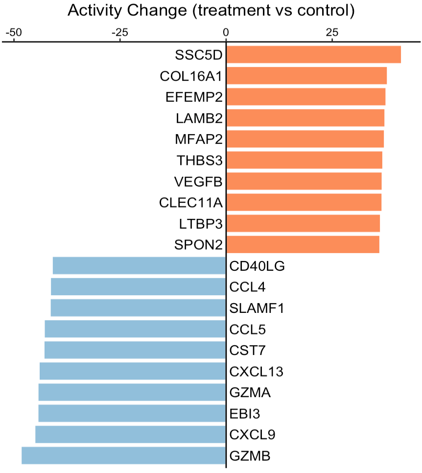

---
output: github_document
---


```{r, include = FALSE}
knitr::opts_chunk$set(
  collapse = TRUE,
  comment = "#>"
)
```

This tutorial demonstrates how to infer the activity change of secreted proteins between two phenotypes, such as treatment vs control, tumor vs normal, or responder vs non-responder. The input expression values, from either RNA sequencing or MicroArray, should be transformed by log2(x+1). Of note, x could be FPKM, RPKM, or TPM for RNA-Seq data.

For this demonstration, we employ a clinical <a href="https://www.ncbi.nlm.nih.gov/geo/query/acc.cgi?acc=GSE100093" target="_blank">cohort</a> of patients with discoid lupus erythematosus, who received a single dose of anti-IFNG antibody AMG 811. Using the SecAct framework, we will predict the activity change of secreted proteins between treatment and control groups.

## Prepare expression data

This section shows how to read an expression matrix to the R environment and separate samples into the treatment and control groups. 

``` r
library(SecAct)

# prepare expression matrix
dataPath <- file.path(system.file(package="SecAct"), "extdata/")
expr <- read.csv(paste0(dataPath,"GSE100093.IFNG.expr.gz"), sep="\t")

# read meta infomation
meta <- read.csv(paste0(dataPath,"GSE100093.IFNG.meta"), sep="\t")

# subset treatment and control groups
expr.treatment <- expr[, meta[,"Treatment"]=="Anti-IFNG"]
expr.control <- expr[, meta[,"Treatment"]=="Control"]

``` 

## Infer activity change

We input `expr.treatment` and `expr.control` into `SecAct.activity.inference` to infer the activity change of secreted proteins between treatment and control groups. `SecAct` calculates the OVERALL activity change between two phenotypes with default setting `is.singleSampleLevel = FALSE`. You can also obtain the activity change for each SINGLE sample in `expr.treatment` by setting `is.singleSampleLevel = TRUE`. Of note, if your samples are paired, just change the default setting `is.paired = FALSE` to `TRUE`.

``` r
# infer activity change; ~2 mins
res <- SecAct.activity.inference(
  inputProfile = expr.treatment, 
  inputProfile_control = expr.control,
  is.singleSampleLevel = FALSE,
  is.paired = FALSE
)

# res$zscore stores activity change
act.change <- res$zscore

# show activity change
head(act.change)

```

A positive value means the secreted protein has high activity in the treatment group while a negative value means the secreted protein has high activity in the control group.

``` r
# show IFNG activity change
act.change["IFNG","Change"]

``` 

We can see that IFNG activity was reduced as expected, consistent with the treatment group receiving anti-IFNG therapy.

## Visualize activity change

User can visualize any secreted proteins of interest using `SecAct.bar.plot`. Here, we select the top up- and down-regulated secreted proteins (SPs) between treatment and control as examples.

``` r
# select the top secreted proteins
n <- 10
up.SPs <- names(sort(act.change[,"Change"],decreasing=T))[1:n]
down.SPs <- names(sort(act.change[,"Change"]))[1:n]

SPs <- c(up.SPs, down.SPs)
# user can assign any secreted proteins to SPs

# generate a vector
fg.vec <- act.change[SPs,"Change"]

# visualize in bar plot
SecAct.bar.plot(fg.vec, title="Activity Change (treatment vs control)")

```



A positive value means the secreted protein has high activity in the treatment group while a negative value means the secreted protein has high activity in the control group.

## Run a differential profile

If you already have a differential profile (or signature) instead of the expression matrix from two phenotypes, you can directly run `SecAct.activity.inference` with `is.differential = TRUE`.

``` r
# compare two phenotypes to generate a differential profile
expr.diff <- matrix(
  data = rowMeans(expr.treatment) - rowMeans(expr.control), 
  ncol = 1,
  dimnames = list(
    row_names = rownames(expr.treatment),
    col_names = "Diff"
  )
)

# Run a differential profile; ~2 mins
res <- SecAct.activity.inference(
  inputProfile = expr.diff, 
  is.differential = TRUE
)

# res$zscore stores activity change
act.change <- res$zscore

# show activity change
head(act.change)

``` 
