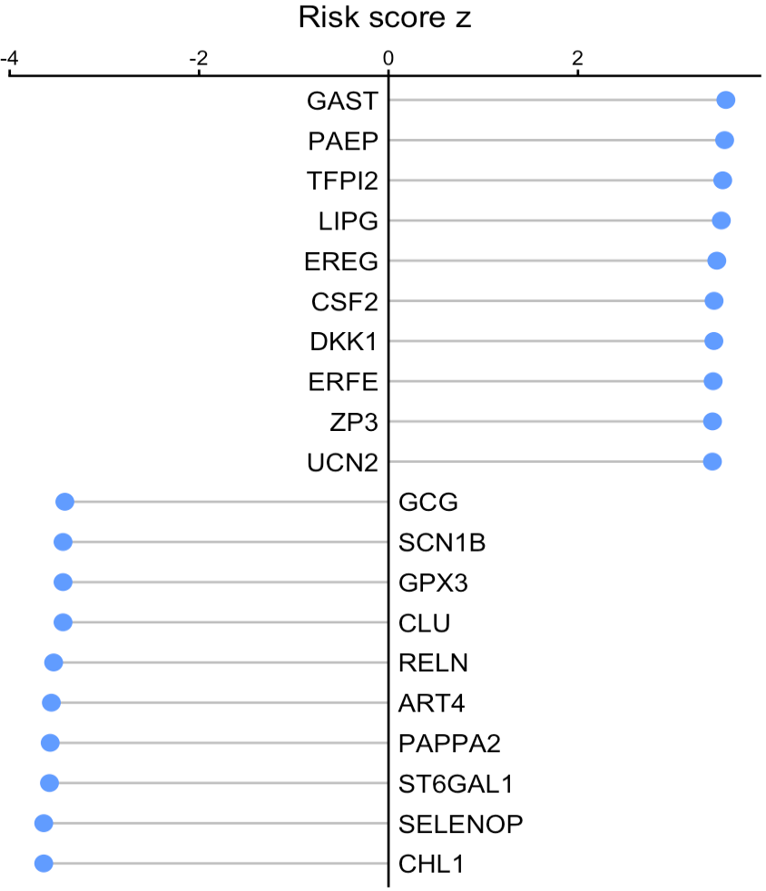
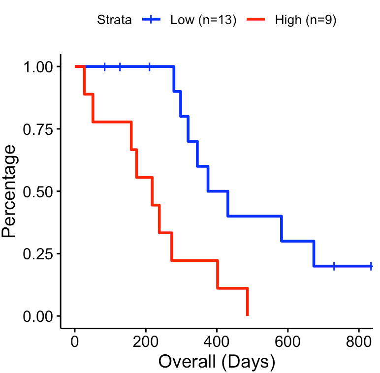

---
output: github_document
---


```{r, include = FALSE}
knitr::opts_chunk$set(
  collapse = TRUE,
  comment = "#>"
)
```

This tutorial demonstrates how to infer the signaling activity of secreted proteins from a large data cohort, and then calculate the relevance of their activity to clinical variables. The input expression values, from either RNA sequencing or MicroArray, should be transformed by log2(x+1). Of note, x could be FPKM, RPKM, or TPM for RNA-Seq data.

For this demonstration, we use an immunotherapy <a href="https://github.com/ParkerICI/prince-trial-data" target="_blank">cohort</a> of patients with pancreatic cancer. Using the SecAct framework, we identify secreted proteins whose activity levels are associated with clinical outcomes.

## Prepare expression data

This section shows how to read an expression matrix to the R environment. 

``` r
library(SecAct)

# prepare expression matrix
dataPath <- file.path(system.file(package="SecAct"), "extdata/")
expr <- read.table(paste0(dataPath,"Pancreatic_Nivolumab_Padron2022.logTPM.gz"), check.names=F)

```

## Infer secreted protein activity

We use `SecAct.activity.inference` to infer the signaling activity of secreted proteins across patients. 

If your data have control samples (e.g., normal patients), you can assign them to `inputProfile_control`. `SecAct` would normalize each gene's expression values with the control samples, i.e., subtracting the mean gene expression of control samples.

If not available, just set `inputProfile_control=NULL` (default). `SecAct` would normalize the expression values of each gene to zero mean across all input profiles. In other words, the mean gene expression of all input profiles are regarded as control.

``` r
# infer activity; ~2 mins
res <- SecAct.activity.inference(inputProfile=expr, inputProfile_control=NULL)

# res$zscore stores activity
act <- res$zscore

# show activity
act[1:6,1:3]

``` 

The inferred protein activity is a relative measure. A positive value indicates high activity in the corresponding patients, while a negative value signifies low activity.

## Calculate clinical relevance

We next calculate the risk score for each secreted protein by linking their activity levels with clinical information. For the clinical file, please make sure the name of the 1st and 2nd columns are "Time" and "Event", respectively. `SecAct.coxph.regression` will conduct Cox proportional hazard (PH) regression, with risk scores represented as z-scores (Coef / StdErr) from the two-sided Wald test. Of note, clinical covariates (e.g., age, gender, stage) would also be considered in regression if available.

``` r
# read clinical infomation
clinical <- read.table(paste0(dataPath,"Pancreatic_Nivolumab_Padron2022.OS_Nivo+Sotiga+Chemo"))

head(clinical)

##    Time Event Age Gender ECOG
## 8   834     0  55      1    0
## 13   28     1  60      0    1
## 15  273     1  69      0    0
## 22  159     1  69      0    1
## 24  569     0  62      0    0
## 25  264     1  66      1    1

# compute risk score
riskMat <- SecAct.coxph.regression(act, clinical)

head(riskMat)

``` 

For the risk score z, a positive value means the secreted protein is associated with poorer survival while a negative value means the secreted protein is associated with better survival.

## Visualize risk score

User can visualize any secreted proteins of interest using `SecAct.lollipop.plot`. Here, we select the top high and low risk secreted proteins (SPs), which are associated with poorer and better survival, respectively.

``` r
# select the top secreted proteins
n <- 10
high.risk.SPs <- names(sort(riskMat[,"risk score z"],decreasing=T))[1:n]
low.risk.SPs <- names(sort(riskMat[,"risk score z"]))[1:n]

SPs <- c(high.risk.SPs, low.risk.SPs)
# user can assign any secreted proteins to SPs

# generate a vector
fg.vec <- riskMat[SPs,"risk score z"]

# visualize in lollipop plot
SecAct.lollipop.plot(fg.vec, title="Risk score z")

```



## Draw survival plot

User can select a secreted protein of interest to draw its survival curve using `SecAct.survival.plot`. The activity cutoff was selected by maximizing the difference between high and low activity patient groups.

``` r
# Take secreted protein WNT7B as an example
riskMat["WNT7B",]

# visualize in survival plot
SecAct.survival.plot(act, clinical, "WNT7B", x.title="Overall (Days)")

```


