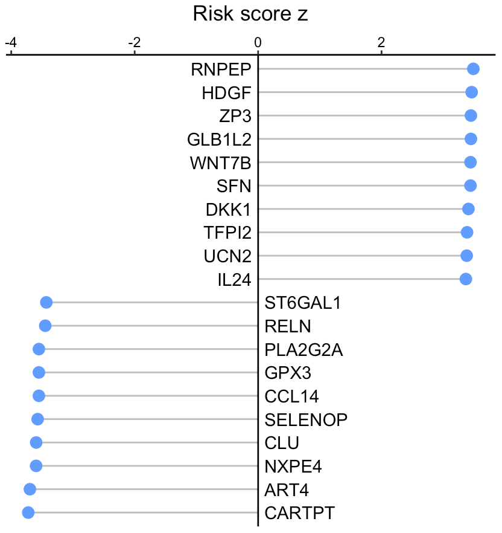

---
output: github_document
---


```{r, include = FALSE}
knitr::opts_chunk$set(
  collapse = TRUE,
  comment = "#>"
)
```

This tutorial demonstrates how to infer the signaling activity of secreted proteins from a large cohort, and then calculate their activity relevance with clinical data. The input expression values, from either RNA sequencing or MicroArray, should be transformed by log2(x+1). Of note, x could be FPKM, RPKM, or TPM for RNA sequencing data.

For this demonstration, we employ an immunotherapy <a href="https://github.com/ParkerICI/prince-trial-data" target="_blank">cohort</a> of pancreatic cancer patients. Using the SecAct framework, we will identify secreted proteins associated with immunotherapy efficacy.

## Prepare expression data

This section shows how to read an expression matrix to R environment. 

``` r
library(SecAct)

# prepare expression matrix
dataPath <- file.path(system.file(package="SecAct"), "extdata/")
expr <- read.table(paste0(dataPath,"Pancreatic_Nivolumab_Padron2022.logTPM.gz"), check.names=F)

```

## Infer secreted protein activity

We use `SecAct.activity.inference` to infer the activity of >1000 secreted proteins across samples. If your data have control samples (e.g., normal patients), you can assign them to `inputProfile_control`. If not available, just set `inputProfile_control=NULL` (default). SecAct would normalize the expression values of each gene to zero mean across all input profiles. In other words, the mean gene expression of all input profiles are regarded as control.

``` r
# infer activity; ~10 mins
res <- SecAct.activity.inference(inputProfile=expr)

# res$zscore stores activity
act <- res$zscore

# show activity
act[1:6,1:3]

##                  2          3           6
## A1BG    -27.104244 -24.572367 -13.2677965
## A2M       6.680395   6.097205  14.8814865
## A2ML1     4.369943  -2.016608   5.2873155
## AADACL2  -1.193300  -2.046660  -0.1879382
## ABHD15  -14.441596 -12.734870  -8.2587602
## ABI3BP   20.304553  14.203647  25.4980024

``` 

## Calculate clinical relevance

We next calculate the risk score for each secreted protein by integrating their activity levels with clinical data. For clinical file, please make sure the name of the 1st and 2nd columns are "Time" and "Event", respectively.

``` r
# read clinical infomation
clinical <- read.table(paste0(dataPath,"Pancreatic_Nivolumab_Padron2022.OS_Nivo+Sotiga+Chemo"))

head(clinical)

##    Time Event Age Gender ECOG
## 8   834     0  55      1    0
## 13   28     1  60      0    1
## 15  273     1  69      0    0
## 22  159     1  69      0    1
## 24  569     0  62      0    0
## 25  264     1  66      1    1

# compute risk score
riskMat <- SecAct.coxph(act, clinical)

head(riskMat)

##            risk z     p value
## A1BG    -2.187803 0.028683943
## A2M     -3.372297 0.000745439
## A2ML1    1.668025 0.095310824
## AADACL2 -1.960305 0.049960191
## ABHD15  -2.511890 0.012008638
## ABI3BP  -1.679394 0.093075338

``` 

## Visualize risk score

User can visualize any secreted proteins of interest. Here, we select the top high and low risk secreted proteins as examples.

``` r
# select top 10 secreted proteins (SPs)
high.SPs <- names(sort(riskMat[,"risk z"],decreasing=T))[1:10]
low.SPs <- names(sort(riskMat[,"risk z"]))[1:10]

SPs <- c(high.SPs, low.SPs)
# user can assign any secreted proteins to SPs

# generate a vector
fg.vec <- riskMat[SPs,"risk z"]

# visualize in lollipop plot
SecAct.lollipop.plot(fg.vec, title="Risk score z")

```



A positive value means the secreted protein is associated with unfavorable (pro-tumor) outcome while a negative value means the secreted protein is associated with favorable (anti-tumor) outcome.

## Draw survival plot

User can select a secreted protein of interest to draw its survival plot using `SecAct.survival.plot`.

``` r
# Take WNT7B as an example
riskMat["WNT7B",]

##       risk z      p value 
## 3.3252642698 0.0008833476 

# visualize in bar plot
SecAct.survival.plot(act, clinical, "WNT7B", x.title="Overall (Days)")

```


The activity cutoff was selected by maximizing the difference between high and low patient groups.
