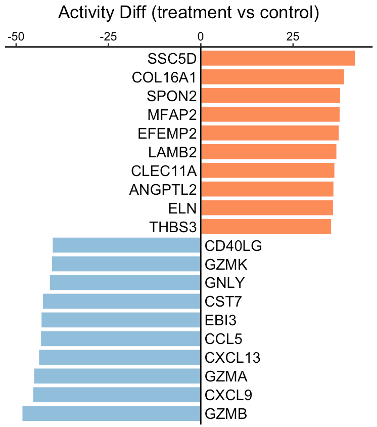

---
output: github_document
---


```{r, include = FALSE}
knitr::opts_chunk$set(
  collapse = TRUE,
  comment = "#>"
)
```

This tutorial demonstrates the process of inferring differences in secreted protein activity between two phenotypes, such as treatment vs control, tumor vs normal, or responder vs non-responder. The input expression values, from either RNA sequencing or MicroArray, should be transformed by log2(x+1). Of note, x could be FPKM, RPKM, or TPM for RNA sequencing data.

For this demonstration, we employ a clinical <a href="https://www.ncbi.nlm.nih.gov/geo/query/acc.cgi?acc=GSE100093" target="_blank">cohort</a> of patients with discoid lupus erythematosus, who received a single dose of anti-IFNG antibody AMG 811. Using the SecAct framework, we will estimate differences in secreted protein activity between treatment and control groups.

## Prepare expression data

This section demonstrates how to read an expression matrix and 

``` r
library(SecAct)

# prepare expression matrix
dataPath <- file.path(system.file(package="SecAct"), "extdata/")
expr <- read.csv(paste0(dataPath,"GSE100093.IFNG.expr.gz"), sep="\t")

# read meta infomation
meta <- read.csv(paste0(dataPath,"GSE100093.IFNG.meta"), sep="\t")

# subset treatment and control group
expr.treatment <- expr[,meta[,"Treatment"]=="Anti-IFNG"]
expr.control <- expr[,meta[,"Treatment"]=="Control"]

``` 

## Infer activity difference

We input `expr.treatment` and `expr.control` into `SecAct.activity.inference` to infer the activity difference of >1000 secreted proteins between treatment and control groups. Setting `is.singleSampleLevel = FALSE` leads SecAct to calculate the overall activity change between two phenotypes. You can also obtain the activity change for each sample in `expr.treatment` by `is.singleSampleLevel = TRUE`.

``` r
# infer activity difference; ~2 mins
res <- SecAct.activity.inference(
  inputProfile = expr.treatment, 
  inputProfile_control = expr.control,
  is.singleSampleLevel = FALSE
)

# res$zscore stores activity difference
act.diff <- res$zscore

# show activity difference
head(act.diff)

##              Diff
## A1BG    12.412416
## A2M      1.654828
## A2ML1   -7.130571
## AADACL2  8.538400
## ABHD15   1.720629
## ABI3BP  -8.170191

# show IFNG activity difference
act.diff["IFNG","Diff"]

## [1] -35.67649

``` 

We can see that IFNG activity was decreased because the treatment group received anti-IFNG therapy.

## Visualize activity difference

User can visualize any secreted proteins of interest. Here, we select the top up- and down-regulated secreted proteins between treatment and control as examples.

``` r
# select top 10 secreted proteins (SPs)
up.SPs <- names(sort(act.diff[,"Diff"],decreasing=T))[1:10]
down.SPs <- names(sort(act.diff[,"Diff"]))[1:10]

SPs <- c(up.SPs, down.SPs)
# user can assign any secreted proteins to SPs

# generate a vector
fg.vec <- act.diff[SPs,"Diff"]

# visualize in bar plot
SecAct.bar.plot(fg.vec, title="Activity Diff (treatment vs control)")

```



A positive value means the secreted protein has high activity in the treatment group while a negative value means the secreted protein has high activity in the control group.

## Run against to differential profile

If you already have a differential profile (or signature) instead of the expression matrix from two phenotypes, you can directly run `SecAct.activity.inference` with `is.differential = TRUE`.

``` r
# compare two phenotypes to get differential profile
expr.diff <- rowMeans(expr.treatment) - rowMeans(expr.control)

# generate input matrix
expr.diff <- as.matrix(expr.diff, ncol=1)
colnames(expr.diff) <- "Diff"


# Run against to differential profile
res <- SecAct.activity.inference(
  inputProfile = expr.diff, 
  is.differential = TRUE
)

# res$zscore stores activity difference
act.diff <- res$zscore

# show activity difference
head(act.diff)

``` 
