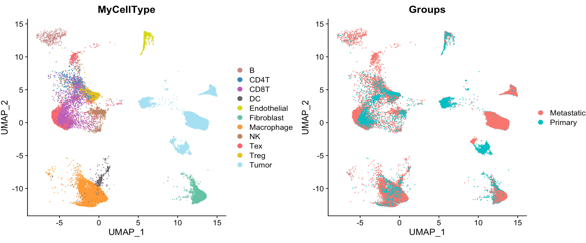
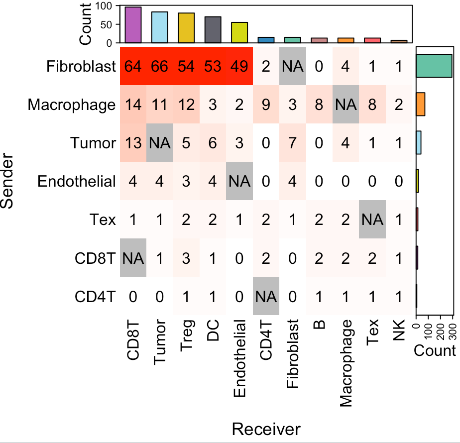
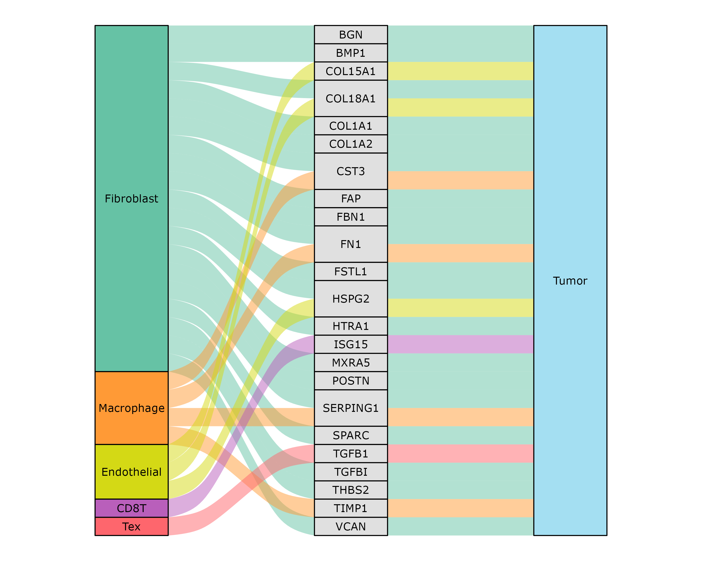

---
output: github_document
---


```{r, include = FALSE}
knitr::opts_chunk$set(
  collapse = TRUE,
  comment = "#>"
)
```

This tutorial demonstrates how to infer secreted protein-mediated cell-cell communication (CCC) from scRNA-seq data. This analysis requires an scRNA-seq dataset with two distinct conditions. SecAct employs two key criteria to identify condition-specific cell-cell communication mediated by a particular secreted protein: (1) upregulated gene expression of the secreted protein in one cell type (defined the source cell type), and (2) increased signaling activity of the same secreted protein in another cell type (defined the receiver cell type). For this demonstration, we employ an ovarian cancer (OV) scRNA-Seq <a href="https://www.nature.com/articles/s43018-023-00599-8" target="_blank">study</a> containing samples from both primary and metastatic sites.

## Prepare expression matrix
The OV scRNA-Seq data is stored in a Seurat object. The information of cell-type annotations and anatomical sites are stored in the columns `MyCellType` and `Groups` of `meta.data` from this Seurat object, respectively. Users can easily access them using the following code.

``` r
library(SecAct)
library(Seurat)

# load scRNA-Seq data
dataPath <- "https://hpc.nih.gov/~Jiang_Lab/SecAct_Package/OV_scRNAseq_Seurat.rds"
Seurat_obj <- readRDS(url(dataPath))

# cell count
table(Seurat_obj@meta.data[,"Groups"])

## Metastatic    Primary 
##      18746      17589 

# show UMAP plot
my_cols <- c(
	'B'='#C88888','CD4T'='#3288bd','CD8T'='#B95FBB','DC'='#63636d',
	'Endothelial'='#D4D915','Fibroblast'='#66c2a5','Macrophage'='#ff9a36',
	'NK'='#bb8761','Tex'='#fe666d','Treg'='#E6C122','Tumor'='#A4DFF2'
)

p1 <- DimPlot(Seurat_obj, reduction = "umap", cols = my_cols, group.by = "MyCellType")
p2 <- DimPlot(Seurat_obj, reduction = "umap", group.by = "Groups")

p1+p2

```



## Infer cell-cell communication

`SecAct` performs three steps to infer condition-specific cell-cell communication mediated by secreted proteins: (1) assessing changes in secreted protein expression for each cell type (defined the source cell type) between two conditions, (2) calculating changes in secreted protein activity for each cell type (defined the receiver cell type) between two conditions, and (3) linking source and receiver cell types.

When running `SecAct.CCC.scRNAseq`, user need to assign the `cellType_meta` and `condition_meta` with the column names of cell-type annotation and condition information in `Seurat_obj@meta.data`, respectively. Also, claim what case and control conditions are by `conditionCase` and `conditionControl`. User can find the SecAct results in `Seurat_obj @misc $SecAct_output`.

``` r
# infer activity; ~5 mins
Seurat_obj <- SecAct.CCC.scRNAseq(
  Seurat_obj, 
  cellType_meta="MyCellType",
  condition_meta="Groups", 
  conditionCase="Metastatic", 
  conditionControl="Primary"
)  

# show output
names(Seurat_obj @misc $SecAct_output)

## [1] "SecretedProteinExpression"
## [2] "SecretedProteinActivity"
## [3] "SecretedProteinCCC"

# cell-cell communication results
head(Seurat_obj @misc $SecAct_output $SecretedProteinCCC)

``` 

## Visualize cell-cell communication

We provide two types of visualization plot for cell-cell communication, i.e., heatmap and circle plot. The number in the heatmap represents the count of secreted proteins from senders to receivers.

``` r
SecAct.CCC.heatmap(Seurat_obj, row.sorted=TRUE, column.sorted=TRUE, colors_cellType=my_cols)
SecAct.CCC.circle(Seurat_obj, colors_cellType=my_cols)
```




## Visualize secreted signaling flow

User can select the cell-cell communication of interest from `Seurat_obj @misc $SecAct_output $SecretedProteinCCC` to visualize them using `SecAct.CCC.sankey`. You need to assign values to `sender`, `secretedProtein`, and `receiver`.

``` r
sender <- c("Fibroblast","Macrophage","Endothelial","CD8T","Tex")

secretedProtein <- c(
  "BGN","BMP1","COL15A1","COL18A1","COL1A1",
  "COL1A2","CST3","FAP","FBN1","FN1",
  "FSTL1","HSPG2","HTRA1","ISG15","MXRA5",
  "POSTN","SERPING1","SPARC","TGFB1","TGFBI",
  "THBS2","TIMP1","VCAN"
)

receiver <- c("Tumor")

SecAct.CCC.sankey(
  Seurat_obj, 
  colors_cellType = my_cols, 
  sender = sender, 
  secretedProtein = secretedProtein, 
  receiver = receiver
)

```

<center></center>
