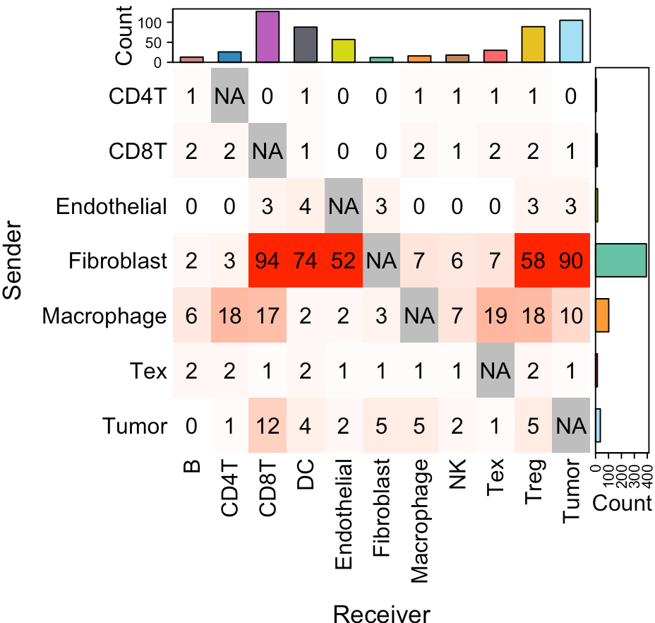
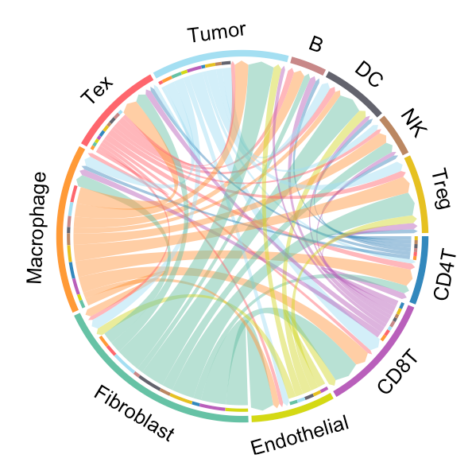

---
output: github_document
---


```{r, include = FALSE}
knitr::opts_chunk$set(
  collapse = TRUE,
  comment = "#>"
)
```

This tutorial demonstrates how to infer cell-cell communication (CCC) mediated by secreted proteins from scRNA-seq data. The SecAct analysis requires an scRNA-seq dataset with two distinct conditions. SecAct employs two key criteria to identify condition-specific cell-cell communication for a particular secreted protein: (1) upregulated expression of the secreted protein in the sender cell type and (2) increased signaling activity of the same secreted protein in the receiver cell type. For this demonstration, we employ an ovarian cancer (OV) scRNA-Seq <a href="https://data.mendeley.com/datasets/rc47y6m9mp/2" target="_blank">dataset</a> containing samples from both primary and metastatic sites.

## Prepare expression matrix
We have preprocessed this OV scRNA-Seq dataset and saved it as a Seurat object. The information of cell-type annotations and anatomical sites are stored in the columns `MyCellType` and `Groups` of meta data from the Seurat object, respectively. Users can easily access them using the following code.

``` r
library(SecAct)
library(Seurat)

# load scRNA-Seq data
dataPath <- file.path(system.file(package="SecAct"), "extdata/")
Seurat_obj <- readRDS(paste0(dataPath,"OV_scRNAseq.rds"))

# cell count
table(Seurat_obj@meta.data[,"Groups"])

## Metastatic    Primary 
##      18746      17589 

# show UMAP plot
my_cols <- c(
	'B'='#C88888','CD4T'='#3288bd','CD8T'='#B95FBB','DC'='#63636d',
	'Endothelial'='#D4D915','Fibroblast'='#66c2a5','Macrophage'='#ff9a36',
	'NK'='#bb8761','Tex'='#fe666d','Treg'='#E6C122','Tumor'='#A4DFF2'
)

p1 <- DimPlot(Seurat_obj, reduction = "tsne", cols = my_cols, group.by = "MyCellType")
p2 <- DimPlot(Seurat_obj, reduction = "tsne", group.by = "Groups")

p1+p2
```


## Infer cell-cell communication

Our strategy performs three steps to infer condition-specific cell-cell communication: (1) calculating changes in secreted protein activity for each cell type between two conditions, (2) assessing changes in secreted protein expression for each cell type between two conditions, and (3) linking sender and receiver cell types.

When running `SecAct.CCC.scRNAseq`, user need to claim which column in `Seurat_obj@meta.data` stores cell-type annotations. Also, claim which column stores condition information and what are case and control conditions. All SecAct results are stored in `Seurat_obj @misc $SecAct_output`. 

``` r
# infer activity
Seurat_obj <- SecAct.CCC.scRNAseq(
  Seurat_obj, 
  cellType="MyCellType",
  condition="Groups", 
  conditionCase="Metastatic", 
  conditionControl="Primary")

# show output
names(Seurat_obj @misc $SecAct_output)

## [1] "SecretedProteinActivity"
## [2] "SecretedProteinExpression"
## [3] "SecretedProteinCCC"

# cell-cell communication results
head(Seurat_obj1 @misc $SecAct_output $SecretedProteinCCC [,10:12])

##                          sender secretedProtein   receiver sender_exp_logFC sender_exp_pv sender_exp_pv.adj receiver_act_diff
## Tumor_RARRES2_Treg        Tumor         RARRES2       Treg         1.048683 7.613305e-108     5.217353e-106          6.491628
## Tumor_RARRES2_CD8T        Tumor         RARRES2       CD8T         1.048683 7.613305e-108     5.217353e-106         14.767048
## Tumor_RARRES2_NK          Tumor         RARRES2         NK         1.048683 7.613305e-108     5.217353e-106          3.328219
## Tumor_RARRES2_Tumor       Tumor         RARRES2      Tumor         1.048683 7.613305e-108     5.217353e-106         15.759037
## Tumor_RARRES2_DC          Tumor         RARRES2         DC         1.048683 7.613305e-108     5.217353e-106          7.924789
## Tumor_RARRES2_Fibroblast  Tumor         RARRES2 Fibroblast         1.048683 7.613305e-108     5.217353e-106         12.481952
##                          receiver_act_pv receiver_act_pv.adj overall_strength    overall_pv overall_pv.adj
## Tumor_RARRES2_Treg           0.000999001         0.002912975         6.807658 1.936092e-108  2.287815e-106
## Tumor_RARRES2_CD8T           0.000999001         0.002468818        15.485949 1.936092e-108  2.287815e-106
## Tumor_RARRES2_NK             0.000999001         0.008367471         3.490246 1.936092e-108  2.287815e-106
## Tumor_RARRES2_Tumor          0.000999001         0.001869195        16.526231 1.936092e-108  2.287815e-106
## Tumor_RARRES2_DC             0.000999001         0.002308802         8.310590 1.936092e-108  2.287815e-106
## Tumor_RARRES2_Fibroblast     0.000999001         0.001689368        13.089607 1.936092e-108  2.287815e-106
``` 


## Visualize cell-cell communication

We provide two types of visualization plot for cell-cell communication, i.e., heatmap and circle plot.

``` r
SecAct.CCC.heatmap(Seurat_obj)
SecAct.CCC.circle(Seurat_obj)

```



