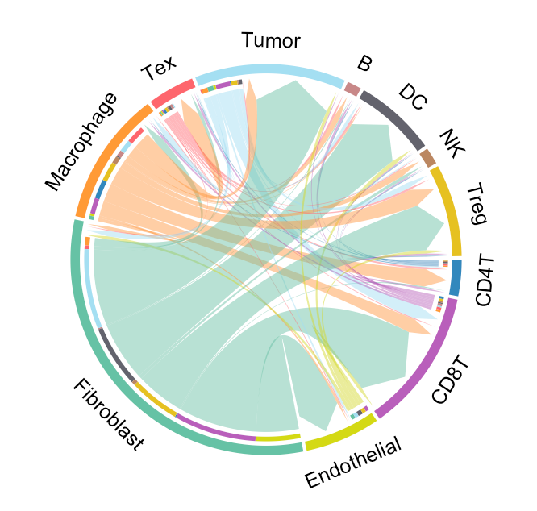

---
output: github_document
---


```{r, include = FALSE}
knitr::opts_chunk$set(
  collapse = TRUE,
  comment = "#>"
)
```

This tutorial demonstrates how to infer secreted protein-mediated cell-cell communication (CCC) from scRNA-seq data. The SecAct analysis requires an scRNA-seq dataset with two distinct conditions. SecAct employs two key criteria to identify condition-specific cell-cell communication for a particular secreted protein: (1) upregulated expression of the secreted protein in the sender cell type; (2) increased signaling activity of the same secreted protein in the receiver cell type. For this demonstration, we employ an ovarian cancer (OV) scRNA-Seq <a href="https://www.nature.com/articles/s43018-023-00599-8" target="_blank">study</a> containing samples from both primary and metastatic sites.

## Prepare expression matrix
The OV scRNA-Seq data is stored in a Seurat object. The information of cell-type annotations and anatomical sites are stored in the columns `MyCellType` and `Groups` of `meta.data` from this Seurat object, respectively. Users can easily access them using the following code.

``` r
library(SecAct)
library(Seurat)

# load scRNA-Seq data
dataPath <- "https://hpc.nih.gov/~Jiang_Lab/SecAct_Package/OV_scRNAseq_Seurat.rds"
Seurat_obj <- readRDS(url(dataPath))

# cell count
table(Seurat_obj@meta.data[,"Groups"])

## Metastatic    Primary 
##      18746      17589 

# show UMAP plot
my_cols <- c(
	'B'='#C88888','CD4T'='#3288bd','CD8T'='#B95FBB','DC'='#63636d',
	'Endothelial'='#D4D915','Fibroblast'='#66c2a5','Macrophage'='#ff9a36',
	'NK'='#bb8761','Tex'='#fe666d','Treg'='#E6C122','Tumor'='#A4DFF2'
)

p1 <- DimPlot(Seurat_obj, reduction = "umap", cols = my_cols, group.by = "MyCellType")
p2 <- DimPlot(Seurat_obj, reduction = "umap", group.by = "Groups")

p1+p2

```


## Infer cell-cell communication

Our strategy performs three steps to infer condition-specific cell-cell communication: (1) calculating changes in secreted protein signaling activity for each cell type between two conditions, (2) assessing changes in secreted protein expression for each cell type between two conditions, and (3) linking sender and receiver cell types.

When running `SecAct.CCC.scRNAseq`, user need to assign the `cellType_meta` and `condition_meta` with the column names of cell-type annotation and condition information in `Seurat_obj@meta.data`, respectively. Also, claim what case and control conditions are by `conditionCase` and `conditionControl`. All `SecAct` results are stored in `Seurat_obj @misc $SecAct_output`.

``` r
# step 1
Seurat_obj <- SecAct.activity.inference.scRNAseq.2(
  Seurat_obj, 
  cellType_meta="MyCellType",
  condition_meta="Groups", 
  conditionCase="Metastatic", 
  conditionControl="Primary"
)

# steps 2 and 3
Seurat_obj <- SecAct.CCC.scRNAseq(
  Seurat_obj, 
  cellType_meta="MyCellType",
  condition_meta="Groups", 
  conditionCase="Metastatic", 
  conditionControl="Primary",
  act_diff_cutoff=2,
  exp_logFC_cutoff=0.2,
  exp_mean_all_cutoff=2,
  exp_fraction_case_cutoff=0.1,
  padj_cutoff=0.01
)  
  
# show output
names(Seurat_obj @misc $SecAct_output)

## [1] "SecretedProteinActivity"
## [2] "SecretedProteinExpression"
## [3] "SecretedProteinCCC"

# cell-cell communication results
head(Seurat_obj @misc $SecAct_output $SecretedProteinCCC)

``` 

## Visualize cell-cell communication

We provide two types of visualization plot for cell-cell communication, i.e., heatmap and circle plot.

``` r
SecAct.CCC.heatmap(Seurat_obj, row.sorted=TRUE, column.sorted=TRUE, colors_cellType=my_cols)
SecAct.CCC.circle(Seurat_obj, colors_cellType=my_cols)
```




User can select the cell-cell communication of interest from `Seurat_obj @misc $SecAct_output $SecretedProteinCCC` to visualize them using `SecAct.CCC.sankey`. You need to assign values to `sender`, `secretedProtein`, and `receiver`.

``` r
sender <- c("Fibroblast","Macrophage","Endothelial","CD8T","Tex")

secretedProtein <- c(
  "COL18A1","CST3","FN1","HSPG2","SERPING1","COL15A1",
  "TGFB1","HSPG2","ISG15","COL18A1","TIMP1","BGN",
  "FAP","THBS2","SPARC","COL1A1","COL1A2","TGFBI",
  "VCAN","POSTN","FBN1","MXRA5","HTRA1","BMP1","FSTL1"
)

receiver <- c("Tumor")

SecAct.CCC.sankey(
  Seurat_obj, 
  colors_cellType = my_cols, 
  sender = sender, 
  secretedProtein = secretedProtein, 
  receiver = receiver
)

```


