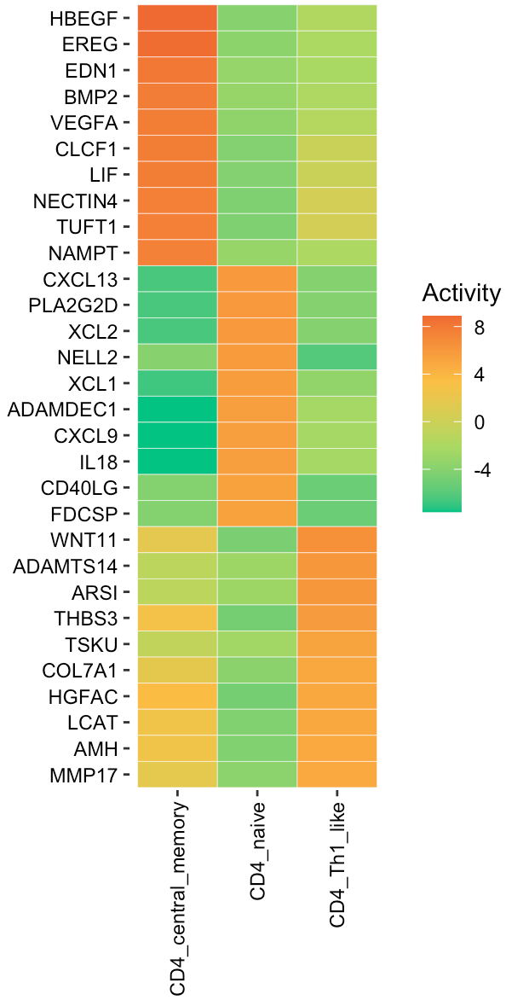

---
output: github_document
---


```{r, include = FALSE}
knitr::opts_chunk$set(
  collapse = TRUE,
  comment = "#>"
)
```

This tutorial demonstrates how to infer secreted protein signaling activity in various cell states. For this demonstration, we employ an ovarian cancer scRNA-Seq <a href="https://www.nature.com/articles/s43018-023-00599-8" target="_blank">study</a>. Using the SecAct framework, we will estimate the signaling activity of secreted proteins for different CD4+ T cell states. 

## Load scRNA-Seq data

The scRNA-Seq data of CD4+ T cells is stored in a Seurat object. Three cell states are annotated in this dataset, i.e., naive, central memory, and helper 1-like. 

``` r
library(SecAct)
library(Seurat)

# load scRNA-Seq data
dataPath <- file.path(system.file(package="SecAct"), "extdata/")
Seurat_obj <- readRDS(paste0(dataPath,"OV_scRNAseq_CD4.rds"))

# cell count
table(Seurat_obj@meta.data[,"Annotation"])

## CD4_central_memory          CD4_naive       CD4_Th1_like 
##                402                 28                358 

# show UMAP plot
Seurat::DimPlot(Seurat_obj, reduction = "umap", group.by = "Annotation")

```


## Infer secreted protein activity 
After loading scRNA-Seq data data, user can input `Seurat_obj` into `SecAct.activity.inference` to infer the activities of >1000 secreted proteins for various cell states. Also, you need to claim which column in the meta matrix of Seurat object has cell state information. In this case, the column name is "Annotation" and thus assign `cellType_meta = "Annotation"`. User can find the SecAct results in `Seurat_obj @misc $SecAct_output $SecretedProteinActivity`.

``` r
# infer activity; ~2 mins
Seurat_obj <- SecAct.activity.inference.scRNAseq(Seurat_obj, cellType_meta="Annotation")

# SecretedProteinActivity$zscore stores activity
act <- Seurat_obj @misc $SecAct_output $SecretedProteinActivity$zscore

# show activity
head(act)

##         CD4_central_memory  CD4_naive CD4_Th1_like
## A1BG            -0.5224152 -2.5877798   5.04170281
## A2M             -1.8165372  1.0789818  -0.08903819
## A2ML1            4.6669228 -3.4408384   1.41266953
## AADACL2          2.2806474 -3.1300577   3.23410538
## ABHD15           0.2801044  0.1688928  -0.55981830
## ABI3BP          -0.7084864  1.5764300  -2.08041961

```

## Visualize activity score

User can visualize any secreted proteins of interest using `SecAct.heatmap.plot`. Here, we select the top active secreted proteins (SPs) for each cell state.

``` r
# select top secreted proteins
n <- 10
SPs.1 <- names(sort(act[,1],decreasing=T))[1:n]
SPs.2 <- names(sort(act[,2],decreasing=T))[1:n]
SPs.3 <- names(sort(act[,3],decreasing=T))[1:n]

SPs <- c(SPs.1, SPs.2, SPs.3)
# user can assign any secreted proteins to SPs

# subset act matrix
fg.mat <- act[SPs,]

# visualize in heatmap
SecAct.heatmap.plot(fg.mat)

```


