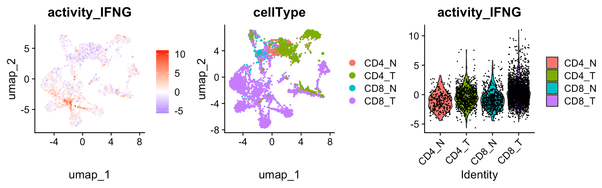

---
output: github_document
---


```{r, include = FALSE}
knitr::opts_chunk$set(
  collapse = TRUE,
  comment = "#>"
)
```

This tutorial demonstrates how to run SecAct to infer secreted protein activity in singl-cell level. The input expression values, from either RNASeq or MicroArray, should be transformed by log2(x+1). x could be FPKM, RPKM, or TPM for RNASeq. Moreover, the input expression matrix should be normalized with the control samples.

## Prepare expression matrix

Here, we use a scRNA-Seq data that includes T cell from both Normal and Tumor tissue.

``` r
library(SecAct)

# load seurat object
seuratPath <- file.path(system.file(package="SecAct"), "extdata/OV_GSE156728.rds")
seurat_obj <- readRDS(seuratPath)

# extract count matrix
expr <-  as.matrix(seurat_obj@assays$RNA@layers$counts)
colnames(expr) <- rownames(seurat_obj@assays$RNA@cells)
rownames(expr) <- rownames(seurat_obj@assays$RNA@features)

# normalize to TPM
expr <- t(t(expr)*1e6/colSums(expr))

# transform to log space
expr <- log2(expr/10 + 1)

# normalized with the control samples
expr <- expr - rowMeans(expr)
expr <- round(expr,3)

# run SecAct to infer activity
res_sc <- SecAct.inference(expr, lambda=10000, nrand=1000)

# show activity
head(res$zscore)
``` 

## Add SecAct output to Seurat object

You can integrate the activity results into the Seurat object, so that visiualize them.

``` r
res_sc_z <- t(res_sc$zscore)
colnames(res_sc_z) <- paste0("activity_",colnames(res_sc_z))

seurat_obj@meta.data <- cbind(seurat_obj@meta.data,res_sc_z)

library(Seurat)
library(ggplot2)
library(patchwork)

p1 <- FeaturePlot(seurat_obj, reduction = "umap", features = c("activity_IFNG")) +
  scale_colour_gradient2(low = "blue", mid = "white", high = "red")
p2 <- DimPlot(seurat_obj, reduction = "umap", group.by = "cellType")
p3 <- VlnPlot(seurat_obj, features = c("activity_IFNG"), )

p1|p2|p3
``` 


