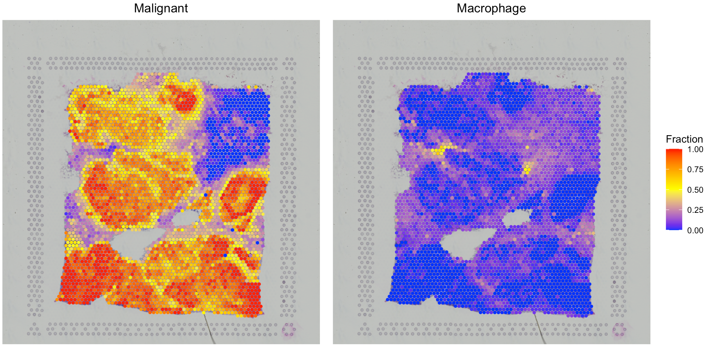
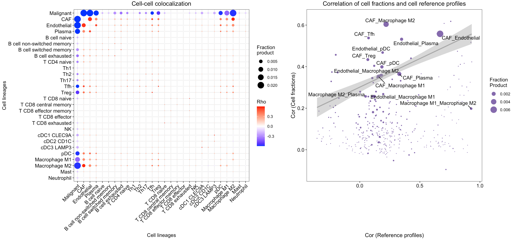

---
output: github_document
---


```{r, include = FALSE}
knitr::opts_chunk$set(
  collapse = TRUE,
  comment = "#>"
)
```

This tutorial demonstrates how to run SecAct to infer secreted protein activity and signaling velocity using a spatial transcriptomics (ST) dataset from endometrial cancer ([Paper](https://www.nature.com/articles/s41586-023-06367-z){target="_blank"}). Before running the tutorial, make sure that you have installed SecAct package as well as SpaCET package. The latter will be employed to create an SpaCET object to store the ST data.

## Read ST data to an SpaCET object
First, download the ST data from [GSE225690](https://www.ncbi.nlm.nih.gov/geo/query/acc.cgi?acc=GSE225690){target="_blank"}. This dataset includes two endometrial cancer patients treated with anti-Netrin-1 (NTN1) compound. Netrin-1 is a secreted glycoprotein that plays critical roles in angiogenesis and cell survival, and blocking NTN1 inhibits tumor growth. In the data folder, 01_039_C1d1 and 01_039_C3d1 represent pre- and on-treatment tumor samples for Patient 01_039, respectively. To read ST data into R, user can create an SpaCET object by using `create.SpaCET.object.10X`.

``` r
library(SpaCET)

# set the path to the download folder.
dataPath <- "/Users/rub2/Downloads/GSE225690_RAW/"

# load ST data to create an SpaCET object.
# read on-treatment sample
visiumPath <- paste0(dataPath,"01_039_C3d1/outs/")
SpaCET_obj_on <- create.SpaCET.object.10X(visiumPath = visiumPath)
SpaCET_obj_on <- SpaCET.quality.control(SpaCET_obj_on)

# read pre-treatment sample
visiumPath <- paste0(dataPath,"01_039_C1d1/outs/")
SpaCET_obj_pre <- create.SpaCET.object.10X(visiumPath = visiumPath)
SpaCET_obj_pre <- SpaCET.quality.control(SpaCET_obj_pre)

```

## Infer secreted protein activity 
After loading ST data, user can run `SecAct.inference` to infer the activities of over 1000 secreted proteins across each spot. Of note, we recommend user set the parameter `Ycontrol` to include a control (or background) for the current ST sample. For example, to analyze the on-treatment sample, the pre-treatment sample can be set as a control. `SecAct` will normalize the expression values of each gene in the on-treatment sample with the all-spot mean from the pre-treatment sample. 

When analyzing the pre-treatment sample, a control sample is unavailable. You can just set the `Ycontrol` as NULL. `SecAct` will normalize the expression values of each gene in the pre-treatment sample to zero mean across all spots. In other words, `SecAct` regards the same ST sample as a control sample.

``` r
library(SecAct)

# calculate secreted protein activity for the on-treatment sample
SpaCET_obj_on <- SecAct.inference(Y = SpaCET_obj_on, Ycontrol = SpaCET_obj_pre)

# calculate secreted protein activity for the pre-treatment sample
SpaCET_obj_pre <- SecAct.inference(Y = SpaCET_obj_pre, Ycontrol = NULL)

# show the activity value
SpaCET_obj_on@results$SecAct_res$zscore[1:13,1:6]
SpaCET_obj_pre@results$SecAct_res$zscore[1:13,1:6]

```

## Visualize the cell type proportion

We provide `SpaCET.visualize.spatialFeature` to present the spatial distribution of cell types.

``` r
# show the spatial distribution of malignant cells and macrophages.
SpaCET.visualize.spatialFeature(
  SpaCET_obj, 
  spatialType = "CellFraction", 
  spatialFeatures=c("Malignant","Macrophage")
)
```


``` r
# show the spatial distribution of all cell types.
SpaCET.visualize.spatialFeature(
  SpaCET_obj, 
  spatialType = "CellFraction", 
  spatialFeatures="All", 
  sameScaleForFraction = TRUE,
  pointSize = 0.1, 
  nrow=5
)
```


Since some cell types have relatively low abundance, user can get a better vision by setting `sameScaleForFraction = FALSE`. In addition, you can open up an interactive visualization panel by setting `interactive=TRUE` to browse the deconvolution results.

``` r
SpaCET.visualize.spatialFeature(SpaCET_obj,interactive=TRUE)
```


## Estimate cell-cell interactions
After decomposing cell fractions, SpaCET can infer intercellular interactions based on cell colocalization and ligand-receptor coexpression. Linear correlations of cell fraction between cell types are computed across all ST spots to evaluate cell-type colocalization. High positive correlations indicate that cell-type pairs tend to colocalize together. To infer physical interactions, SpaCET tests the co-expression of ligand and receptor genes within the same ST spot for the co-localized cell-type pairs.

### Find co-localized cell-type pairs

SpaCET provides `SpaCET.CCI.colocalization` and `SpaCET.visualize.colocalization` to compute and visualize the co-localized cell-type pairs.

``` r
# calculate the cell-cell colocalization.
SpaCET_obj <- SpaCET.CCI.colocalization(SpaCET_obj)

# visualize the cell-cell colocalization.
SpaCET.visualize.colocalization(SpaCET_obj)
```


