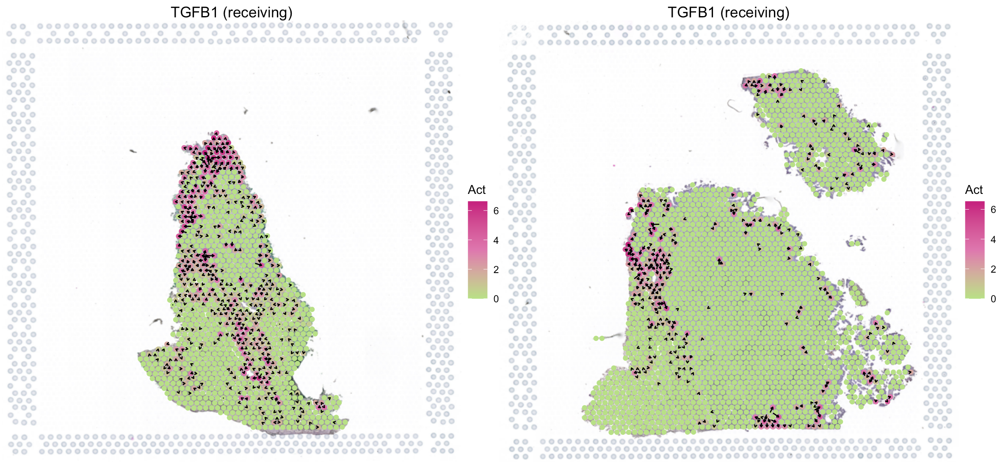

---
output: github_document
---


```{r, include = FALSE}
knitr::opts_chunk$set(
  collapse = TRUE,
  comment = "#>"
)
```

This tutorial demonstrates how to run SecAct to infer secreted protein activity and signaling velocity using a spatial transcriptomics (ST) dataset from endometrial cancer ([Paper](https://www.nature.com/articles/s41586-023-06367-z){target="_blank"}). Before running the tutorial, make sure that you have installed SecAct package as well as SpaCET package. The latter will be employed to create an SpaCET object to store the ST data.

## Read ST data to an SpaCET object
This dataset includes two endometrial cancer patients treated with anti-Netrin-1 (NTN1) compound. Netrin-1 is a secreted glycoprotein that plays critical roles in angiogenesis and cell survival, and blocking NTN1 inhibits tumor growth. Each patient has both pre- and on-treatment tumor samples, respectively. To read ST data into R, user can create an SpaCET object by using `create.SpaCET.object.10X`.

``` r
library(SpaCET)

# set the path to the data folder.
dataPath <- file.path(system.file(package="SecAct"), "extdata/")

# load ST data to create an SpaCET object.
# read on-treatment sample
visiumPath <- paste0(dataPath,"UCEC_On/")
SpaCET_obj_on <- create.SpaCET.object.10X(visiumPath = visiumPath)
SpaCET_obj_on <- SpaCET.quality.control(SpaCET_obj_on)

# read pre-treatment sample
visiumPath <- paste0(dataPath,"UCEC_Pre/")
SpaCET_obj_pre <- create.SpaCET.object.10X(visiumPath = visiumPath)
SpaCET_obj_pre <- SpaCET.quality.control(SpaCET_obj_pre)

```

## Infer secreted protein activity 
After loading ST data, user can run `SecAct.inference` to infer the activities of over 1000 secreted proteins across each spot. Of note, to analyze the on-treatment sample, the pre-treatment sample will be set as a control. Then, normalize the expression values of each gene in the on-treatment sample with the all-spot mean from the pre-treatment sample. 

When analyzing the pre-treatment sample, a control sample is unavailable. Just normalize the expression values of each gene in the pre-treatment sample to zero mean across all spots. In other words, you just regard the same ST sample as a control sample.

``` r

# extract count matrix
expr_on <- as.matrix(SpaCET_obj_on@input$counts)
expr_pre <- as.matrix(SpaCET_obj_pre@input$counts)

# normalize to TPM
expr_on <- t(t(expr_on)*1e6/colSums(expr_on))
expr_pre <- t(t(expr_pre)*1e6/colSums(expr_pre))

# transform to log space
expr_on <- log2(expr_on/10 + 1)
expr_pre <- log2(expr_pre/10 + 1)

# normalized with the control samples
expr_on_rmControl <- expr_on - rowMeans(expr_pre)
expr_on_rmControl <- round(expr_on_rmControl,3)

expr_pre_rmControl <- expr_pre - rowMeans(expr_pre)
expr_pre_rmControl <- round(expr_pre_rmControl,3)

# run SecAct to infer activity
library(SecAct)
res_on <- SecAct.inference(expr_on_rmControl, lambda=10000, nrand=1000)
res_pre <- SecAct.inference(expr_pre_rmControl, lambda=10000, nrand=1000)

``` 

## Add SecAct output to SpaCET object

You can integrate the activity results into the SpaCET object, so that visiualize them.

``` r

SpaCET_obj_on@results$activity <- res_on
SpaCET_obj_pre@results$activity <- res_pre

library(patchwork)
p1 <- SecAct.spatial.velocity(SpaCET_obj_pre, gene = "TGFB1", signalMode="receiving") 
p2 <- SecAct.spatial.velocity(SpaCET_obj_on, gene = "TGFB1", signalMode="receiving") 

p1|p2

``` 



