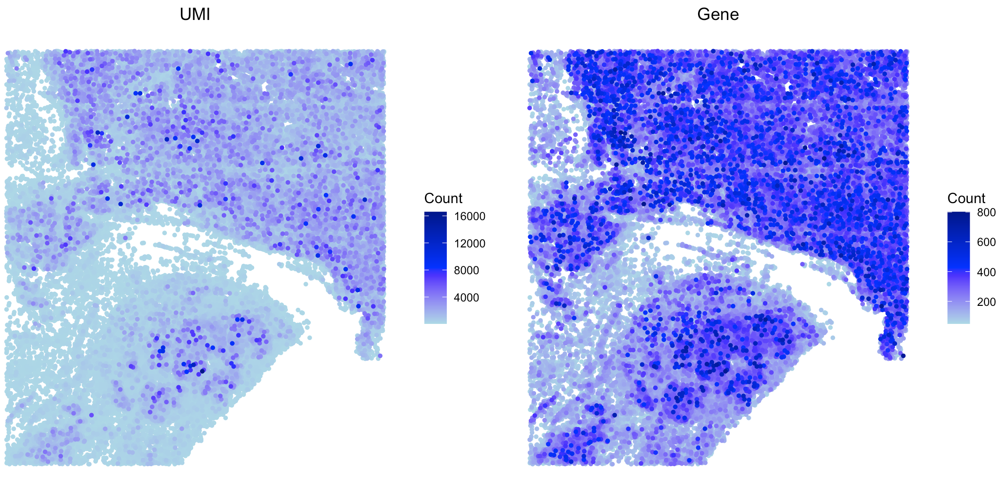
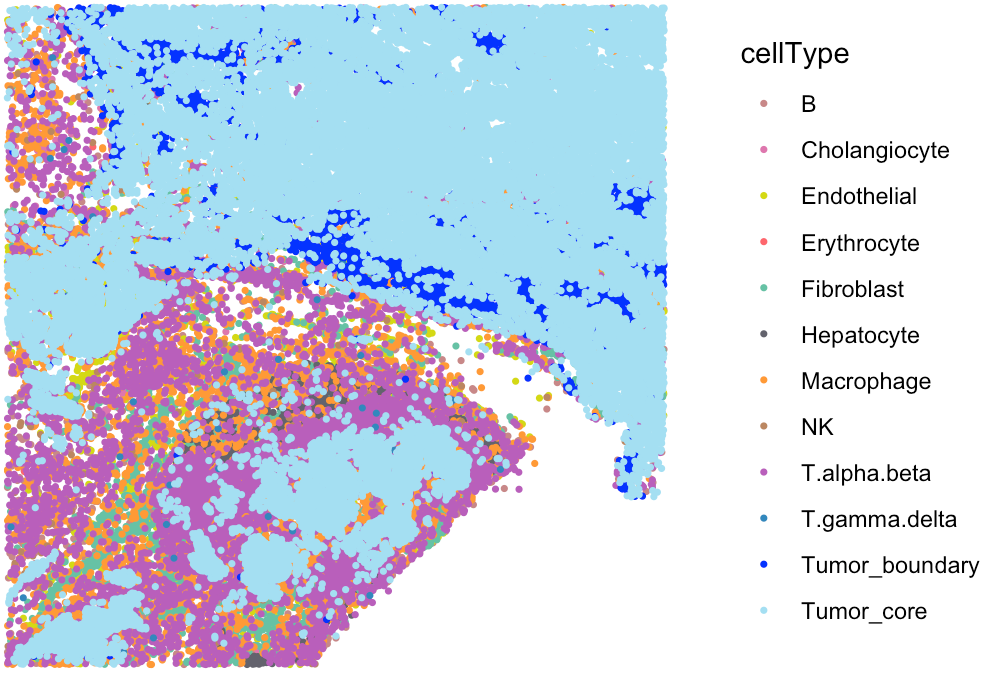
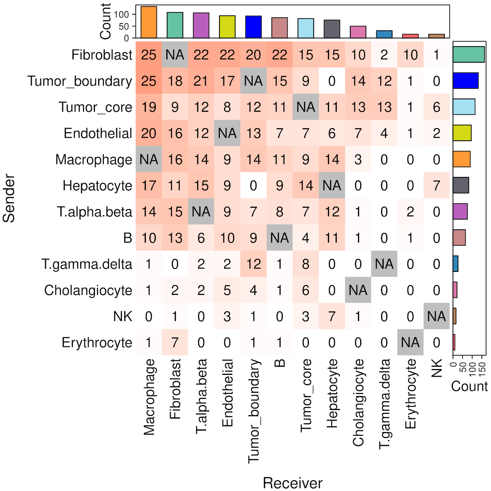
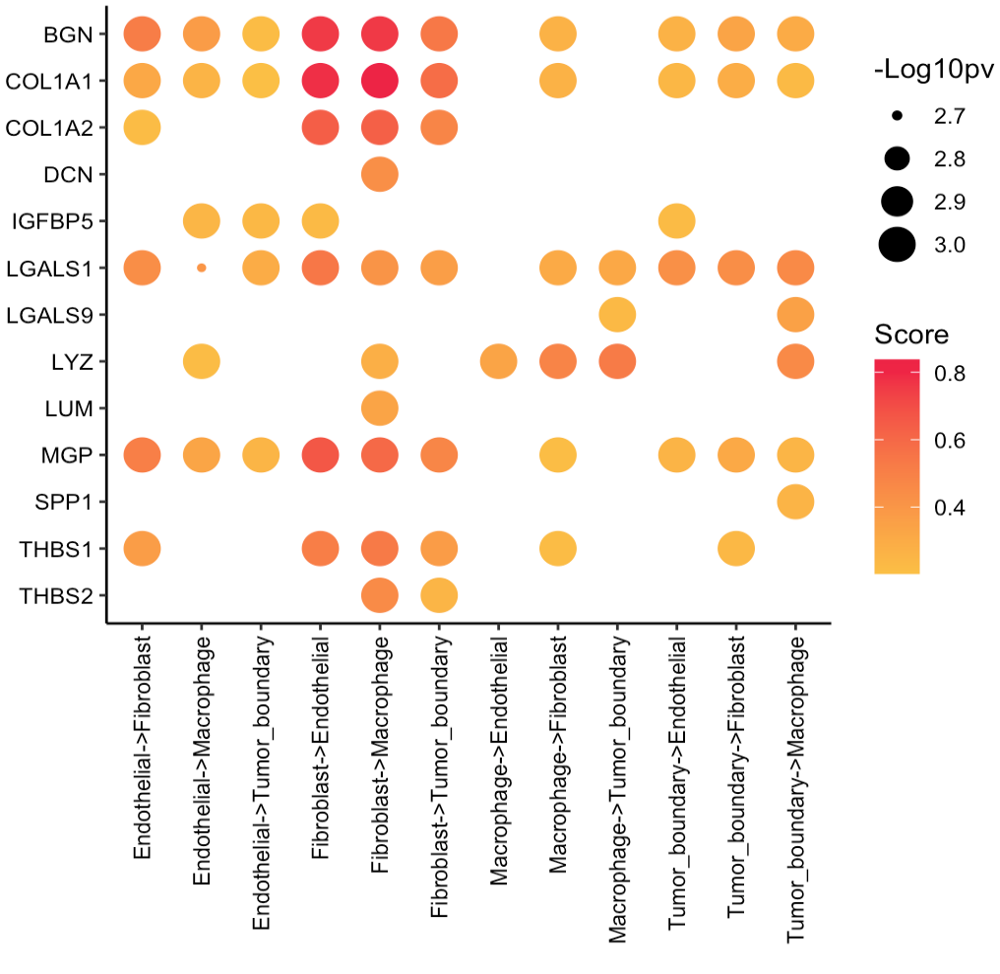
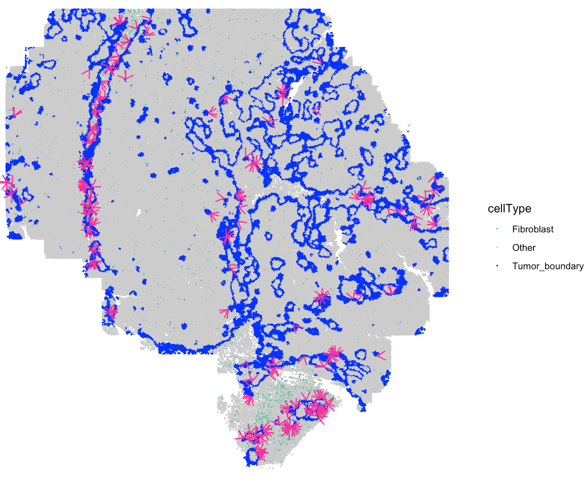

---
output: github_document 
---


```{r, include = FALSE}
knitr::opts_chunk$set(
  collapse = TRUE,
  comment = "#>"
)
```

This tutorial demonstrates how to infer cell-cell communication (CCC) mediated by secreted proteins from single-cell resolution spatial transcriptomics (ST) data. For this demonstration, we employ a liver cancer ST sample from CosMx platform [<a href="https://nanostring.com/products/cosmx-spatial-molecular-imager/ffpe-dataset/human-liver-rna-ffpe-dataset/" target="_blank">Link</a>]. Before running the tutorial, make sure that you have installed SecAct as well as our previous R package [SpaCET](https://github.com/data2intelligence/SpaCET/){target="_blank"}. Here, SpaCET will be used to create a SpaCET object to store the ST data.

## Read ST data to a SpaCET object
To load data into R, user can create a SpaCET object by preparing three types of input data. 

1) count data. The spatial transcriptomics count data must be in the format of matrix with gene name (row) x cell ID (column).
2) spatial location information. The cell coordinates should be in the format of matrix with cell ID (row) x coordinates (column). The 1st and 2nd columns represent X and Y coordinates, respectively.
3) meta data (optional). The meta data should be in the format of matrix with cell ID (row) and meta annotation (column).

``` r
library(SecAct)
library(SpaCET)

# download data from https://hpc.nih.gov/~Jiang_Lab/SecAct_Package/LIHC_CosMx_data.rda
# load CosMx data
load("LIHC_CosMx_data.rda")

# show count matrix
dim(counts)
## [1]   1000 460441

# show coordinate matrix
spotCoordinates[1:5,]

##             coordinate_x_um coordinate_y_um
## c_2_100_733         6708.16         9033.40
## c_2_101_240         7500.24         8861.56
## c_2_101_339         7605.60         8736.04
## c_2_101_452         7629.84         9172.60
## c_2_102_179         7868.24         8993.68

# show meta information
metaData[1:5,]

##                    cellType         niche
## c_2_100_733      Tumor_core tumor subtype
## c_2_101_240 Tumor_interface     interface
## c_2_101_339      Tumor_core         tumor
## c_2_101_452      Tumor_core tumor subtype
## c_2_102_179      Tumor_core         tumor


# create a SpaCET object
SpaCET_obj <- create.SpaCET.object(
  counts = counts,
  spotCoordinates = spotCoordinates,
  metaData = metaData,
  imagePath = NA,
  platform = "CosMx"
)

# show this object.
str(SpaCET_obj)


# filter out cells with less than 50 expressed genes
SpaCET_obj <- SpaCET.quality.control(SpaCET_obj, min.genes=50)

## [1] "Removing cells with less than 50 expressed genes."
## [1] "16926 cells are removed."
## [1] "443515 cells are kept."

# plot the QC metrics
SpaCET.visualize.spatialFeature(
  SpaCET_obj, 
  spatialType = "QualityControl", 
  spatialFeatures=c("UMI","Gene"),
  imageBg = TRUE,
  pointSize = 0.1
)
```



The `SpaCET_obj@metaData` contains the cell type annotation from the original study. 

``` r
# show the spatial distribution of all cell types
my_cols <- c(
  'B'='#C88888','Erythrocyte'='#fe666d','T.alpha.beta'='#B95FBB','T.gamma.delta'='#3288bd',
  'NK'='#bb8761','Hepatocyte'='#63636d','Cholangiocyte'='#de77ae','Endothelial'='#D4D915',
  'Fibroblast'='#66c2a5','Macrophage'='#ff9a36','Tumor_core'='#A4DFF2','Tumor_boundary'='blue',
  'Other'='#cccccc'
)

SpaCET.visualize.spatialFeature(
  SpaCET_obj, 
  spatialType = "metaData", 
  spatialFeatures= "cellType",
  colors = my_cols,
  pointSize = 0.1
)
```




## Infer secreted protein activity 
After loading ST data, user can run `SecAct.activity.inference.ST` to infer the signaling activities of secreted proteins for each spot. The output are stored in `SpaCET_obj @results $SecAct_output $SecretedProteinActivity`, which includes four items, (1) beta: regression coefficients; (2) se: standard error; (3) zscore: beta/se; (4): pvalue: two-sided test p value of z score from permutation test.

``` r
# infer activity; ~30 mins
SpaCET_obj <- SecAct.activity.inference.ST(
  inputProfile = SpaCET_obj,
  scale.factor = 1000,
  sigFilter=TRUE
)

# show activity
SpaCET_obj @results $SecAct_output $SecretedProteinActivity $zscore[1:6,1:3]


``` 


## Infer cell-cell communication
After calculating the secreted protein activity, SecAct could further estimate the consensus pattern from these inferred signaling activities across the whole tissue slide. This module contains two steps.

First, `SecAct` filters >1,000 secreted proteins to identify the significant secreted proteins mediating intercellular communication in this slide. To achieve this, `SecAct` will calculate the Spearman correlation of secreted protein s signaling activity and its neighbor cells’ sum expression. The p values were adjusted by the Benjamini-Hochberg (BH) method as false discovery rate (FDR). The cutoffs are r > 0.05 and FDR < 0.01.

Second, We designed a computational strategy to statistically test whether a type of secreted protein s mediates the intercellular communication from cell type 1 to cell type 2. Cell-type annotations were retrieved from the original study. First, we identified all neighboring pairs of cells, where one cell was from cell type 1 and the other from cell type 2, based on spatial proximity (distance < 20 μm). Among these neighboring pairs, we identified communicating pairs of cells as those where cell type 1 expressed RNA for s (count > 0), and cell type 2 exhibited signaling activity for s (activity score > 0). We then calculated a communication score for cell type 1 → s → cell type 2, defined as the ratio of communicating pairs to total neighboring pairs. The p-value is Probability (random ratio >= real ratio), computed through 1000 randomizations adjusted by the Benjamini–Hochberg procedure. In each randomization, we randomly permuted the cell IDs within each cell type. A cell type 1 → s → cell type 2 communication is considered significant if ratio > 0.2 and FDR < 0.01.

``` r
# infer CCC; ~20 mins
SpaCET_obj <- SecAct.CCC.scST(
    SpaCET_obj,
    cellType_meta = "cellType",
    scale.factor = 1000,
    radius = 20,
    ratio_cutoff = 0.2,
    padj_cutoff = 0.01
)

# show output
head(SpaCET_obj @results $SecAct_output $SecretedProteinCCC)
```


## Visualize cell-cell communication

We provide two types of visualization plot for cell-cell communication, i.e., heatmap and circle plot. The number in the heatmap represents the count of secreted proteins from senders to receivers.

``` r
SecAct.CCC.heatmap(SpaCET_obj, row.sorted=TRUE, column.sorted=TRUE, colors_cellType=my_cols)
SecAct.CCC.circle(SpaCET_obj, colors_cellType=my_cols)

```




User can select the cell-cell communication of interest from `SpaCET_obj @results $SecAct_output $SecretedProteinCCC` to visualize them using `SecAct.CCC.dot`. You need to assign values to `sender`, `secretedProtein`, and `receiver`.

``` r
cellTypes <- c("Tumor_boundary","Fibroblast","Macrophage","Endothelial")

secretedProtein <- c(
  "BGN","COL1A1","COL1A2","DCN","IGFBP5",
  "LGALS1","LGALS9","LYZ","LUM","MGP",
  "SPP1","THBS1","THBS2"
)

SecAct.CCC.dot(
  SpaCET_obj, 
  sender=cellTypes, 
  secretedProtein=secretedProtein, 
  receiver=cellTypes
)

```




## Visualize secreted signaling velocity
User can select the cell-cell communication of interest from `SpaCET_obj @results $SecAct_output $SecretedProteinCCC` to visualize them using `SecAct.signaling.velocity.scST`. You need to assign values to `sender`, `secretedProtein`, and `receiver`.

```
SecAct.signaling.velocity.scST(
  SpaCET_obj, 
  sender="Fibroblast", 
  secretedProtein="THBS2", 
  receiver="Tumor_boundary", 
  cellType_meta="cellType"
)

```



```
SecAct.signaling.velocity.scST(
  SpaCET_obj, 
  sender="Fibroblast", 
  secretedProtein="THBS2", 
  receiver="Tumor_boundary", 
  cellType_meta="cellType", 
  CustomizedAreaCoordinates=c(8290,8366,1100,1400)
)

```


