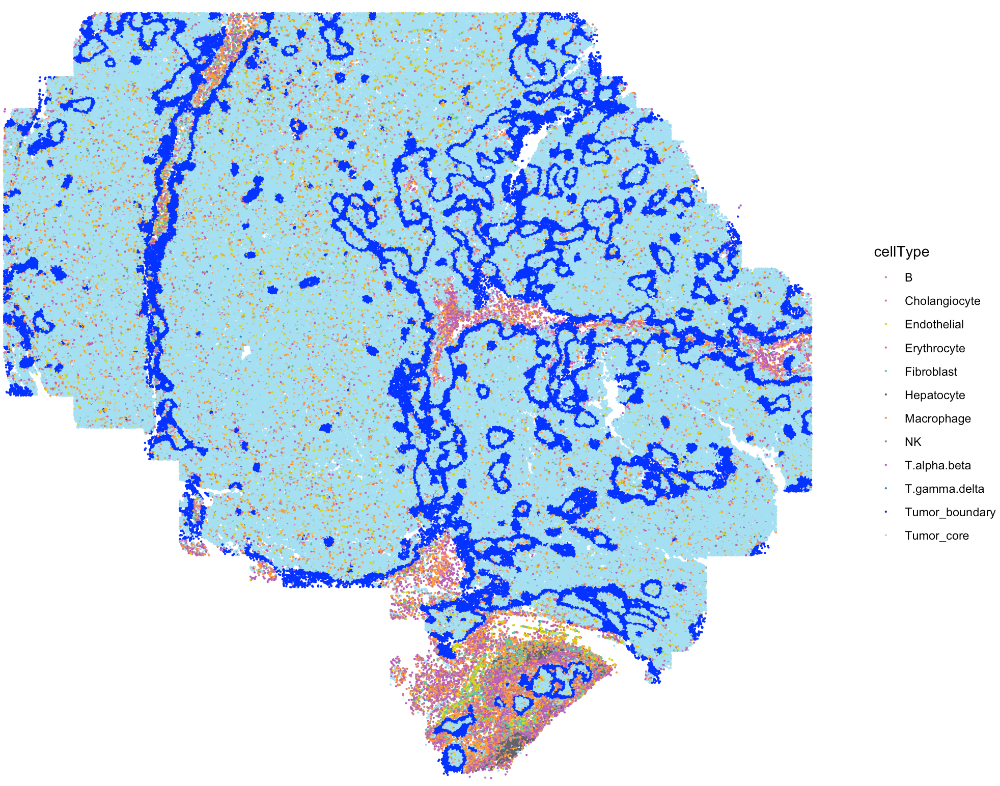

---
output: github_document 
---


```{r, include = FALSE}
knitr::opts_chunk$set(
  collapse = TRUE,
  comment = "#>"
)
```

This tutorial demonstrates how to run SecAct to infer cell-cell communication (CCC) mediated by secreted proteins from single-cell resolution spatial transcriptomics (ST) data. For this demonstration, we employ a liver cancer ST <a href="https://nanostring.com/products/cosmx-spatial-molecular-imager/ffpe-dataset/human-liver-rna-ffpe-dataset/" target="_blank">sample</a>. Due to the exceptionally large number of cells (~0.5 million) in this sample, we focus on a subset of regions containing 50,888 cells for demonstration purposes.

Before running the tutorial, make sure that you have installed SecAct as well as our previous R package [SpaCET](https://github.com/data2intelligence/SpaCET/){target="_blank"}, which is an analytical framework for ST data. Here, SpaCET will be employed to create a SpaCET object to store the ST data.

## Read ST data to a SpaCET object
To load data into R, user can create a SpaCET object by preparing two types of input data. 

1) spatial transcriptomics count data. The spatial transcriptomics count data must be in the format of matrix with gene name (row) x spot ID (column).
2) spatial location information. The spot coordinates should be in the format of matrix with spot ID (row) x coordinates (column). This 1st and 2nd columns represent X and Y coordinates, respectively.

``` r
library(SecAct)
library(SpaCET)

dataPath <- file.path(system.file(package="SecAct"), "extdata/")
load(paste0(dataPath,"/LIHC_CosMx_toy.rda"))

# show count matrix
dim(counts)
## [1]  1000 50888

# show coordinate matrix
spotCoordinates[1:5,]

##              x_slide_mm y_slide_mm       cellType
## c_2_323_101     6.60536    3.32788     Tumor_core
## c_2_324_367     6.83920    3.10276 Tumor_boundary
## c_2_324_628     6.92860    3.43312     Tumor_core
## c_2_324_924     6.82864    3.21076     Tumor_core
## c_2_325_1167    7.57440    3.14704     Tumor_core

# load ST data to create an SpaCET object
SpaCET_obj <- create.SpaCET.object(
  counts=counts,
  spotCoordinates=spotCoordinates,
  metaData=metaData,
  imagePath=NA,
  platform = "CosMx"
)

# show this object.
str(SpaCET_obj)


# show the spatial distribution of all cell types
my_cols <- c(
	'B'='#C88888','Erythrocyte'='#fe666d','T.alpha.beta'='#B95FBB','T.gamma.delta'='#3288bd',
	'NK'='#bb8761','Hepatocyte'='#63636d','Cholangiocyte'='#de77ae','Endothelial'='#D4D915',
	'Fibroblast'='#66c2a5','Macrophage'='#ff9a36','Tumor_core'='#A4DFF2','Tumor_interface'='blue'
)

SpaCET.visualize.spatialFeature(
  SpaCET_obj, 
  spatialType = "metaData", 
  spatialFeatures= "cellType",
  colors = my_cols,
  pointSize = 0.6
)
```



``` r
# filter out cells with less than 50 expressed genes
SpaCET_obj <- SpaCET.quality.control(SpaCET_obj, min.genes=50)

# plot the QC metrics
SpaCET.visualize.spatialFeature(
  SpaCET_obj, 
  spatialType = "QualityControl", 
  spatialFeatures=c("UMI","Gene"),
  imageBg = TRUE
)
```


## Infer cell-cell communication

Our strategy performs three steps to infer condition-specific cell-cell communication: (1) calculating changes in secreted protein activity for each cell type between two conditions, (2) assessing changes in secreted protein expression for each cell type between two conditions, and (3) linking sender and receiver cell types.

When running `SecAct.CCC.ST`, user need to claim which column in `Seurat_obj@meta.data` stores cell-type annotations. Also, claim which column stores condition information and what are case and control conditions. All SecAct results are stored in `Seurat_obj @misc $SecAct_output`. 

``` r
# infer activity
SpaCET_obj <- SecAct.CCC.scST(
    SpaCET_obj,
    cellType_meta = "cellType",
    scale.factor = 1000,
    radius = 0.02,
    ratio_cutoff = 0.2,
    padj_cutoff = 0.01
)

# show output
names(SpaCET_obj @results $SecAct_output)
```
