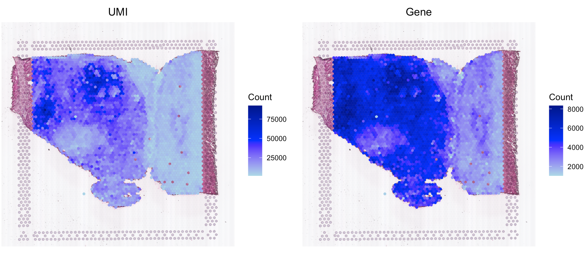
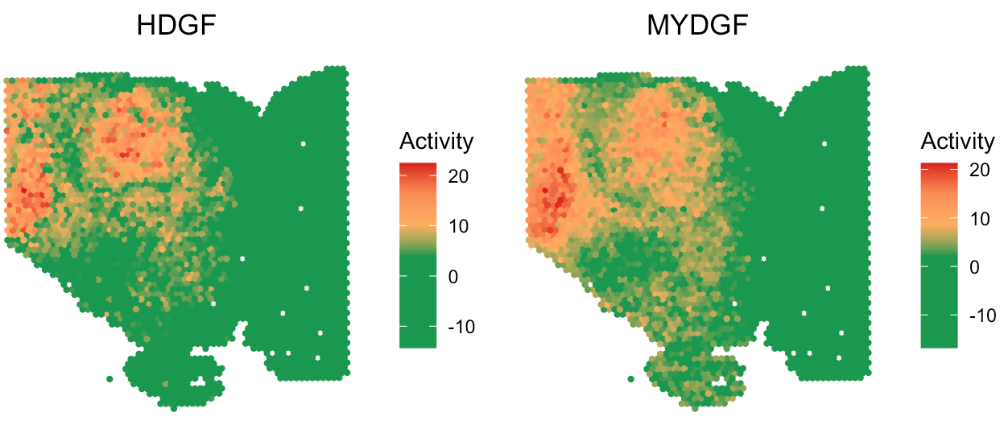
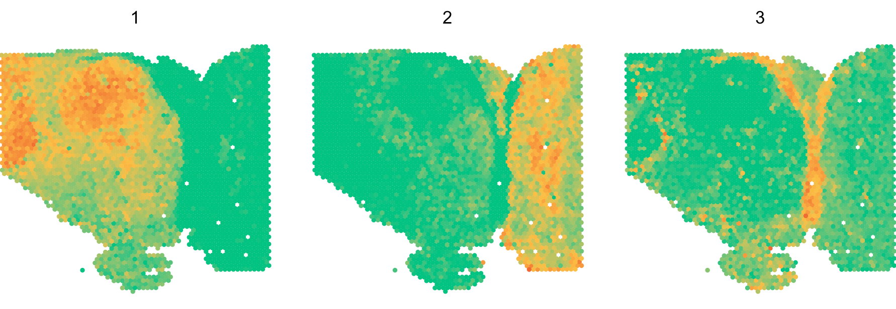
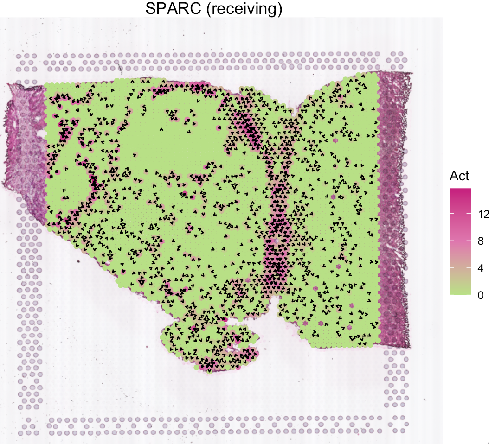
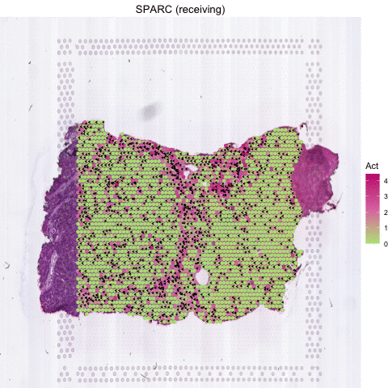
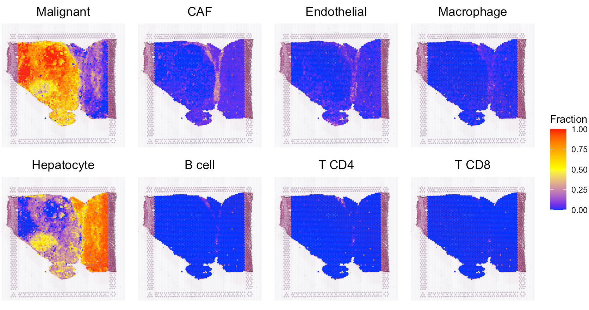
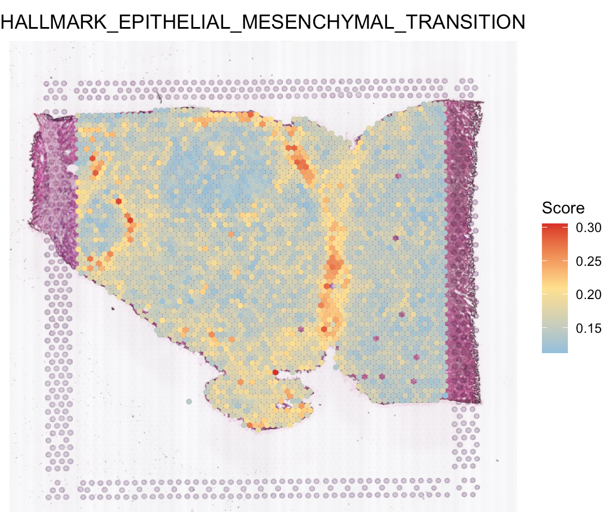

---
output: github_document
---


```{r, include = FALSE}
knitr::opts_chunk$set(
  collapse = TRUE,
  comment = "#>"
)
```

This tutorial demonstrates how to infer secreted protein activities of each spot for a liver cancer spatial transcriptomics (ST) sample from Visium platform ([Paper](https://www.thno.org/v12p4163.htm){target="_blank"}). Each spot is 55 µm in diameter covering [1-10 cells](https://kb.10xgenomics.com/hc/en-us/articles/360035487952-How-many-cells-are-captured-in-a-single-spot){target="_blank"}. Further, SecAct provides additional modules to analyze the signaling patterns and velocities across the whole slide. Before running the tutorial, make sure that you have installed SecAct as well as our previous R package [SpaCET](https://github.com/data2intelligence/SpaCET/){target="_blank"}. Here, SpaCET will be used to create a SpaCET object to store the ST data.

## Read ST data to a SpaCET object
To load data into R, user can create a SpaCET object by using `create.SpaCET.object.10X`. Please make sure that `visiumPath` points to the standard output folders of 10x Space Ranger. If the ST data is not from 10x/Visium, you can use `create.SpaCET.object` instead [<a href="https://data2intelligence.github.io/SpaCET/articles/oldST_PDAC.html" target="_blank">details</a>].

``` r
library(SecAct)
library(SpaCET)

# set the path to the data folder
dataPath <- file.path(system.file(package="SecAct"), "extdata/")

# load ST data to create an SpaCET object
visiumPath <- paste0(dataPath,"Visium_HCC/")
SpaCET_obj <- create.SpaCET.object.10X(visiumPath = visiumPath)

# filter out spots with less than 1000 expressed genes
SpaCET_obj <- SpaCET.quality.control(SpaCET_obj, min.genes = 1000)

# plot the QC metrics
SpaCET.visualize.spatialFeature(
  SpaCET_obj, 
  spatialType = "QualityControl", 
  spatialFeatures = c("UMI","Gene"),
  imageBg = TRUE
)

```



## Infer secreted protein activity 
After loading ST data, user can run `SecAct.activity.inference.ST` to infer the activities of >1,000 secreted proteins for each spot. The output are stored in `SpaCET_obj @results $SecAct_output $SecretedProteinActivity`, which includes four items, (1) beta: regression coefficients; (2) se: standard error; (3) zscore: beta/se; (4): pvalue: two-sided test p value of z score from permutation test.

``` r
# infer activity; ~10 mins
SpaCET_obj <- SecAct.activity.inference.ST(
  inputProfile = SpaCET_obj,
  scale.factor = 1e+05
)

# show activity
SpaCET_obj @results $SecAct_output $SecretedProteinActivity $zscore[1:6,1:3]

# visualize HDGF and MYDGF signaling activity
SpaCET.visualize.spatialFeature(
     SpaCET_obj, 
     spatialType = "SecretedProteinActivity", 
     spatialFeatures=c("HDGF","MYDGF"),
     imageBg=FALSE,
     colors=c("#1A9850","#1A9850","#1A9850","#1A9850","#FDAE61","#FC8D59","#D7191C"),
     pointSize=0.8
 )

``` 


## Estimate signaling pattern
After calculating the secreted protein activity, SecAct could further estimate the consensus pattern from these inferred signaling activities across the whole tissue slide. This module contains two steps.

First, `SecAct` filters >1,000 secreted proteins to identify the significant secreted proteins mediating intercellular communication in this slide. To achieve this, `SecAct` will calculate the Spearman correlation of spots' signaling activity and spots' neighbors' RNA expression. The p values were adjusted by the Benjamini-Hochberg (BH) method as false discovery rate (FDR). The cutoffs are r > 0.05 and FDR < 0.01.

Second, `SecAct` employs Non-negative Matrix Factorization ([NMF](https://cran.r-project.org/web/packages/NMF/vignettes/NMF-vignette.pdf){target="_blank"}) to estimate the consensus signaling patterns. A critical parameter in NMF is the factorization rank `k`. User can assign a number vector to `k`, e.g., `k=2:5`. Then, `SecAct.signaling.pattern` would find the optimal number of factors determined as the point preceding the largest decrease in the silhouette value. This will take a while. Based on our pre-calculation, `k=3` is the optimal number of factors. To save time, we directly run against `k=3`.

``` r
# estimate signaling pattern; ~3 mins
SpaCET_obj <- SecAct.signaling.pattern(SpaCET_obj, k=3)


# plot signaling pattern
SpaCET.visualize.spatialFeature(
	SpaCET_obj, 
	spatialType = "SignalingPattern", 
	spatialFeatures = "All", 
	imageBg = FALSE,
	legend.position = "none",
	colors=c("#03c383","#fbbf45","#ef6a32")
)

``` 




Further, `SecAct` can identify secreted proteins associated with each signaling pattern according to the matrix W from NMF results. For one secreted protein (represented by a row in W), the signaling pattern with a value at least twice as large as any other pattern, is designated as the dominant pattern for that protein.

``` r
# identify secreted proteins dominated by pattern 3
pattern.gene <- SecAct.signaling.pattern.gene(SpaCET_obj, n=3)

# show these genes
head(pattern.gene)

``` 

## Calculate signaling velocity

Several secreted proteins with pattern 3 are related to epithelial-mesenchymal transition process, such as COL1A1, TGFB1, and SPARC. By integrating secreted protein-coding gene expression and signaling activity, SecAct can also infer signaling velocity at each spatial spot, indicating the direction and strength of secreted signaling. Let's take SPARC as an example.

``` r
# show SPARC signaling velocity as contour map
SecAct.signaling.velocity.spotST(SpaCET_obj, gene = "SPARC", contourMap = TRUE) 

```


``` r
# show SPARC signaling velocity at spot level
SecAct.signaling.velocity.spotST(SpaCET_obj, gene = "SPARC", contourMap = FALSE) 

``` 



``` r
# show animated SPARC signaling velocity
SecAct.signaling.velocity.spotST(SpaCET_obj, gene = "SPARC", animated=TRUE) 

# anim <- SecAct.signaling.velocity.spotST(SpaCET_obj, gene = "SPARC", animated=TRUE)
# anim_save("my_animation.gif", animation = anim)
``` 



## Deconvolve ST data

For the current ST data, user also can run our previous R package `SpaCET` to estimate the cell lineages for each spot. Click [here](https://data2intelligence.github.io/SpaCET/articles/visium_BC.html){target="_blank"} for more details. Based on the deconvolution results, we can see the interface region consists of fibroblasts, macrophages, and endothelial cells.

``` r
# deconvolve ST data
SpaCET_obj <- SpaCET.deconvolution(
  SpaCET_obj, 
  cancerType = "LIHC", 
  coreNo = 8
)

# show the spatial distribution of all cell types.
SpaCET.visualize.spatialFeature(
  SpaCET_obj, 
  spatialType = "CellFraction", 
  spatialFeatures = c(
    "Malignant","CAF","Endothelial","Macrophage",
    "Hepatocyte","B cell","T CD4","T CD8"), 
  sameScaleForFraction = TRUE,
  pointSize = 0.1, 
  nrow = 2
)

``` 




## Calculate hallmark score
User also can run `SpaCET.GeneSetScore` to estimate the hallmark scores for each spot. Click [here](https://data2intelligence.github.io/SpaCET/articles/GeneSetScore.html){target="_blank"} for more details. You can see that Pattern 3 is correlated with epithelial-mesenchymal transition (EMT).

``` r
# run gene set calculation
SpaCET_obj <- SpaCET.GeneSetScore(SpaCET_obj, GeneSets="Hallmark")

# visualize EMT
SpaCET.visualize.spatialFeature(
  SpaCET_obj, 
  spatialType = "GeneSetScore", 
  spatialFeatures = "HALLMARK_EPITHELIAL_MESENCHYMAL_TRANSITION",
  legend.position = "right",
  imageBg=TRUE,
  pointSize=1.2
)

``` 


