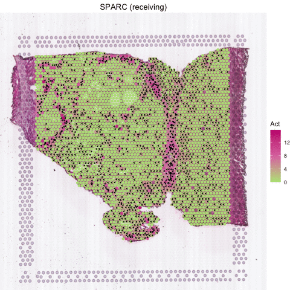

---
output: github_document
---


```{r, include = FALSE}
knitr::opts_chunk$set(
  collapse = TRUE,
  comment = "#>"
)
```

This tutorial demonstrates how to infer secreted protein activities of each spot for a liver cancer spatial transcriptomics (ST) sample from Visium platform ([Paper](https://www.science.org/doi/10.1126/sciadv.abg3750){target="_blank"}). Each spot is 55 µm in diameter covering [1-10 cells](https://kb.10xgenomics.com/hc/en-us/articles/360035487952-How-many-cells-are-captured-in-a-single-spot){target="_blank"}. Further, SecAct provides additional modules to analyze signaling patterns and velocities across the whole slide. Before running the tutorial, make sure that you have installed SecAct as well as our previous R package [SpaCET](https://github.com/data2intelligence/SpaCET/){target="_blank"}, which is an analytical framework for ST data. Here, SpaCET will be employed to create a SpaCET object to store the ST data.

## Read ST data to a SpaCET object
To load data into R, user can create an SpaCET object by using `create.SpaCET.object.10X`. Please make sure that `visiumPath` points to the standard output folders of 10x Space Ranger. If the ST data is not from 10x/Visium, you can use `create.SpaCET.object` instead. Click [here](https://data2intelligence.github.io/SpaCET/articles/oldST_PDAC.html){target="_blank"} for more details.

``` r
library(SecAct)
library(SpaCET)

# set the path to the data folder
dataPath <- file.path(system.file(package="SecAct"), "extdata/")

# load ST data to create an SpaCET object
visiumPath <- paste0(dataPath,"Visium_HCC_1L/")
SpaCET_obj <- create.SpaCET.object.10X(visiumPath = visiumPath)

# filter out spots with less than 1000 expressed genes
SpaCET_obj <- SpaCET.quality.control(SpaCET_obj, min.genes = 1000)

# plot the QC metrics
SpaCET.visualize.spatialFeature(
  SpaCET_obj, 
  spatialType = "QualityControl", 
  spatialFeatures = c("UMI","Gene"),
  imageBg = TRUE
)

```


## Infer secreted protein activity 
After loading ST data, user can run `SecAct.activity.inference` to infer the activities of 1248 secreted proteins for each spot.

``` r
# infer activity
SpaCET_obj <- SecAct.activity.inference.ST(SpaCET_obj)

# show activity
SpaCET_obj @results $SecAct_output $SecretedProteinActivity $zscore[1:6,1:3]

##              50x102      59x19       43x9
## A1BG     2.52789682 -1.4066741 -0.6518619
## A2M     -0.42257303  1.0486118  1.6322600
## A2ML1    0.51650231 -0.1298274 -1.0206257
## AADACL2  0.02978682  1.4617057 -0.8930522
## ABHD15   0.16788758 -0.3654531 -0.6539588
## ABI3BP   0.38397869  0.2679647 -0.1284023

``` 

## Estimate signaling pattern
After obtaining the secreted protein activity, SecAct could further estimate the consensus pattern from these inferred signaling activities across the whole tissue slide. This stage contains two steps.

First, `SecAct` filtered 1248 secreted proteins to identify the secreted proteins mediating intercellular communication. To achieve this, `SecAct` will calculate the linear correlation of spots' RNA expression and spots' neighbors' signaling activity. The cutoffs are r > 0.1 and FDR < 0.01.

Second, `SecAct` employs non-negative matrix factorization ([NMF](https://cran.r-project.org/web/packages/NMF/vignettes/NMF-vignette.pdf){target="_blank"}) to estimate the consensus patterns. A critical parameter in NMF is the factorization rank k. User can assign a number vector to k, e.g., `k=2:5`. Then, `SecAct.signaling.pattern` would find the optimal number of factors determined as the point preceding the largest decrease in the silhouette value. This will take a while. Based on my pre-calculation, `k=3` is the optimal number of factors. To save time, we directly run against `k=3`.

``` r
# estimate signaling pattern
SpaCET_obj <- SecAct.signaling.pattern(SpaCET_obj, k=3)

# plot signaling pattern
SpaCET.visualize.spatialFeature(
	SpaCET_obj, 
	spatialType = "SignalingPattern", 
	spatialFeatures = "All", 
	imageBg = FALSE,
	legend.position = "right"
)

``` 


If you want to identify secreted proteins with specific signaling pattern, please run the following code.

``` r

writeLines(rownames(WWW_n), "/Users/rub2/Downloads/inter_SP.csv")

``` 

## Calculate signaling velocity

Several secreted proteins with pattern 3 are related to epithelial-mesenchymal transition process, such as COL1A1, IL6, TGFB1, and SPARC. By integrating secreted protein-coding gene expression and signaling activity, SecAct can also infer signaling velocity at each spatial spot, indicating the direction and strength of secreted signaling.Let's take SPARC as an example.

``` r
# show signaling velocity of SPARC
SecAct.signaling.velocity.spotST(SpaCET_obj, gene = "SPARC", signalMode="receiving") 

``` 


``` r
# show animated signaling velocity of SPARC
SecAct.spatial.velocity(SpaCET_obj, gene = "SPARC", signalMode="receiving", animated=TRUE) 

``` 



## Deconvolve ST data

For the current ST data, user also can run our previous R package `SpaCET` to estimate the cell lineages for each spot. Click [here](https://data2intelligence.github.io/SpaCET/articles/visium_BC.html){target="_blank"} for more details.

``` r
# deconvolve ST data
SpaCET_obj <- SpaCET.deconvolution(
  SpaCET_obj, 
  cancerType = "LIHC", 
  coreNo = 8
)

# show the spatial distribution of all cell types.
SpaCET.visualize.spatialFeature(
  SpaCET_obj, 
  spatialType = "CellFraction", 
  spatialFeatures = c(
    "Malignant","CAF","Endothelial","Macrophage",
    "Hepatocyte","B cell","T CD4","T CD8"), 
  sameScaleForFraction = TRUE,
  pointSize = 0.1, 
  nrow = 2
)

``` 


Based on the deconvolution results, we can see the interface region consists of fibroblasts, macrophages, and endothelial cells.
